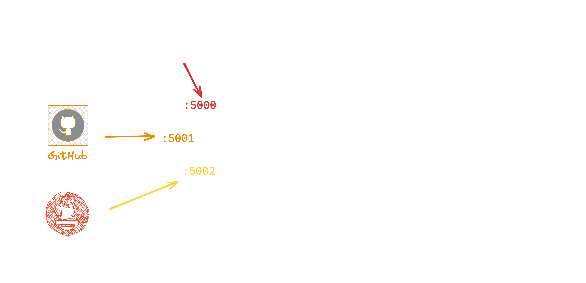

  # From Automated to Automatic

  Event-Driven Infrastructure Management with Ansible


---
layout: two-cols
---

# What is Ansible?

<div class="col">

- **Automation** tool for IT **services** and **configuration**
- **Agentless** via SSH
- Built on **Python** (logic) and **YAML** (configuration)
- **Open Source** and easy to get started with

</div>

::right::

<div class="col justify-center items-center">

  

</div>

<style>

  .col {
    @apply flex flex-col h-full;
  }

  ul {
    @apply pt-16;
  }

  p {
    @apply text-xl;
  }

</style>

---
layout: two-cols
---
# Inventories

- Ansible works with **inventories** of **hosts** and **groups**
- Default inventory is `/etc/ansible/hosts`
- Inventories can be defined using **YAML** or **INI** files
- Inventories can be **static** or **dynamic**
- Inventories can contain **custom variables**


::right::

<div class="code-col">

```yml
webservers:
  hosts:
    webshop.example.com:
      ansible_host: 192.168.1.10
      webserver: apache2
    company.example.com:
      ansible_host: 192.168.1.11
      webserver: httpd
```

</div>

<style>

  ul {
    @apply pt-8;
  }

  .code-col {
    @apply h-full flex flex-col justify-center pl-14;
  }

  code {
    @apply text-sm;
  }

</style>

---
layout: two-cols
clicks: 5
---

# Ansible Ad-Hoc

<p class="pt-16 text-xl">

Ansible can be used to run **ad-hoc** commands on hosts:

</p>

<ul>

<li v-click>

  Specify the **host group** you want to modify

</li>
<li v-click>

  Specify the **inventory** file to use

</li>
<li v-click>

  Specify the **module** to run

</li>
<li v-click>

  Specify additional **arguments** for the module

</li>

</ul>


::right::

<div class="example-col">

```sh {all|2|3|4|5|all}{at:0}
ansible \
   webservers  \
  -i hosts.yml \
  -m package   \
  -a 'name="{{ webserver }}"' \
  --one-line
```

</div>

<style>

  .example-col {
    @apply h-full flex flex-col justify-center pl-14;
  }

</style>

---
layout: section
---

# DEMO

---
layout: two-cols
---

# Imperative vs. Declarative

<div class="col left">

  > "Take two slices of bread. Slice a tomato. Fry the bacon. Wash the lettuce. Put it all together. Serve it to me."

  - Define exactly what you want to **happen**
  - Can be very **verbose**
  - **Error-prone** and hard to **reproduce**

</div>

::right::

<div class="col right">
  
  > "I'd like a BLT sandwich."

  - Define what you expect the **result** to be
  - **Concise** and **easy to understand**
  - **Reproducible**

</div>

<style>
  
  .col {
    @apply flex flex-col justify-between h-96 gap-4xl pt-4;
  }

  .right {
    @apply mt-14 pl-6;
    @apply border-l border-gray;
  }

  blockquote {
    p {
      @apply text-2xl;
    }
  }

</style>

---
layout: two-cols
clicks: 5
---

# Tasks

<p class="pt-16 text-xl">

**Tasks** are the **building blocks** of declarative Ansible:

</p>

<ul>
  <li v-click>

  A **description** of the task's action isn't mandatory, but it's good practice
  
  </li>
  <li v-click>

  **Modules** define the action to be taken

  </li>
  <li v-click>

  **Arguments** can be passed to the module

  </li>
  <li v-click>

  Additional aspects of the task can be tweaked

  </li>
</ul>

::right::

<div class="code-col">

```yml {all|1|2|3-4|5-6|all}{at:0}
- name: Install webserver
  ansible.builtin.package:
    name: "{{ webserver }}"
    state: present
  become: true
  when: webserver is defined
```

</div>

<style>

  .code-col {
    @apply h-full flex flex-col justify-center pl-14;
  }

</style>

---
layout: default
---

# Roles and Collections

- **Roles** are a way to **organize** your Ansible code (Python and YAML)
- **Collections** are a way to **bundle** roles
- **Ansible Galaxy** is a repository for roles and collections

```sh
ansible-galaxy collection install kubernetes.core 
```

<style>

  ul {
    @apply pt-24 pb-16;
  }

  li {
    @apply my-2 text-xl;
  }

</style>

---
layout: default
clicks: 5
---

# Plays and Playbooks

<p class="pt-8 text-xl">

**Plays** are a collection of **tasks** and/or **roles** that are executed on a **group** of hosts:

</p>

<div class="flex flex-row gap-4 justify-around">

<div>
<ul>
  <li v-click>
  
  Plays take **names**, just like tasks
  
  </li>
  <li v-click>

  Plays should define a **host group** for scoped execution

  </li>
  <li v-click>

  Plays define (pre|post) **tasks** *and* **roles** to execute

  </li>
  <li v-click>

  **Variables** for the tasks and roles can be defined on the play level

  </li>
</ul>

<p v-click="5" class="pt-4 text-xl">

A collection of **Plays** is called a **Playbook**

</p>
</div>

```yml {all|1|2|6-15|4-5|all}{at:0}
- name: Example role
  hosts: webservers
  gather_facts: false
  vars:
    greeting: "Hello World!"
  pre_tasks:
    - name: Say Hello
      ansible.builtin.debug:
        msg: "{{ greeting }}"
  roles:
    - role: example
  post_tasks:
    - name: Say goodbye
      ansible.builtin.debug:
        msg: Goodbye!
```

</div>


<style>
  code {
    @apply text-sm;
  }

</style>

---
layout: section
---

# DEMO

---
layout: section
---

# Why Event-Driven?

---
layout: default
---

# In DevOps, Automation is Key

<div class="facts">
<p>

  ✅ **Tests** are run automatically
</p>
<p>

  ✅ **Builds** are run automatically</p>
<p>

  ✅ **Deployments** are run automatically
</p>
<p>

  ✅ **Infrastructure** is provisioned automatically
</p>
<br />
<p>

  ❌ **Maintenance** and **Incident Response** are done (mostly) manual
</p>
</div>

<style>

  .facts {
    @apply pt-24;
  }

  p {
    @apply my-2 text-xl;
  }

</style>

---
layout: default
---

# Automation for Operations

<p class="p">

  Many tasks in **day to day operations** are **repetitive** and **predictable**:
</p>

<ul>
  <li>

  **Pruning** old backups
  </li>
  <li>

  **Restarting** services upon failure
  </li>
  <li>

  **Scaling** infrastructure, storage, etc.
  </li>
</ul>

<p class="p">

  🛑 With **repetition** comes **boredom** and **human error**
</p>

<style>

  .p {
    @apply pt-16 text-xl;
  }

  li {
    @apply my-2 text-xl;
  }

</style>

---

# Event-Driven Ansible

- Many tasks can be easily **automated** with Ansible

- Triggering these tasks upon external **events** makes the automation **automatic**

- Event Driven Ansible (**EDA**) implements this concept

<style>

  ul {
    @apply pt-24 pb-16;
  }

  li {
    @apply my-2 text-xl;
  }

</style>

---

# EDA Explained




---
layout: two-cols
clicks: 5
---

# Rules and Rulesets

<p class="pt-8 text-xl">

**Rulesets** combine `sources` and `rules` to define `events` that should trigger `actions`:

</p>

<ul>
  <li v-click=1>

  Same as **tasks**, **rulesets** can have a **name**
  
  </li>
  <li v-click=2>

  **Hosts** on which the triggered **actions** should be executed need to be defined

  </li>
  <li v-click=3>

  **Sources** define one or more **event sources** to be used

  </li>
  <li v-click=4>

  **Rules** define the **conditions** and **actions** to be executed

  </li>
</ul>


::right::

<div class="code-col">

```yml {all|1|2|3-6|7-12|all}{at:0}
- name: Greet the world
  hosts: all
  sources:
    - ansible.eda.webhook:
        host: 0.0.0.0
        port: 5000
  rules:
    - name: Hello World!
      condition: 1 == 1  # always true
      action:
        debug:
          msg: "Hello World!"
```

</div>

<style>
  .code-col {
    @apply h-full flex flex-col justify-center pl-14;
  }

  code {
    @apply text-sm;
  }

</style>

---
layout: section
---

# DEMO
