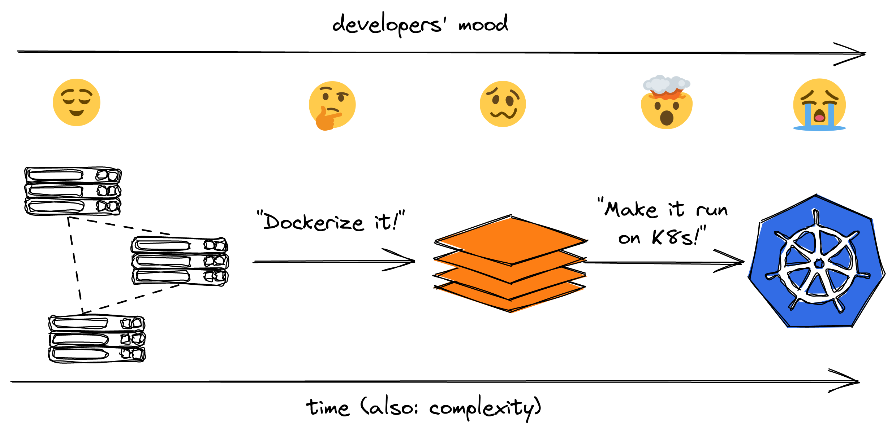
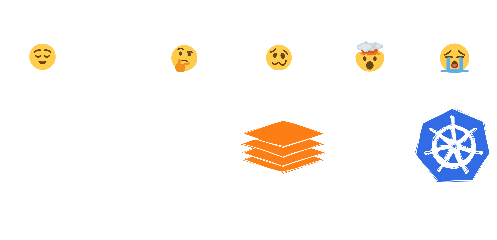
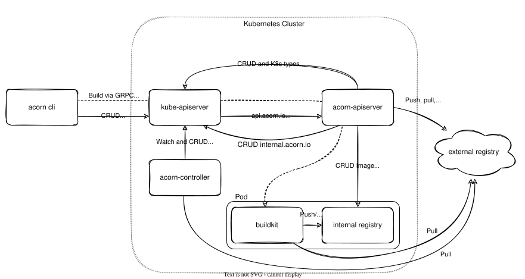
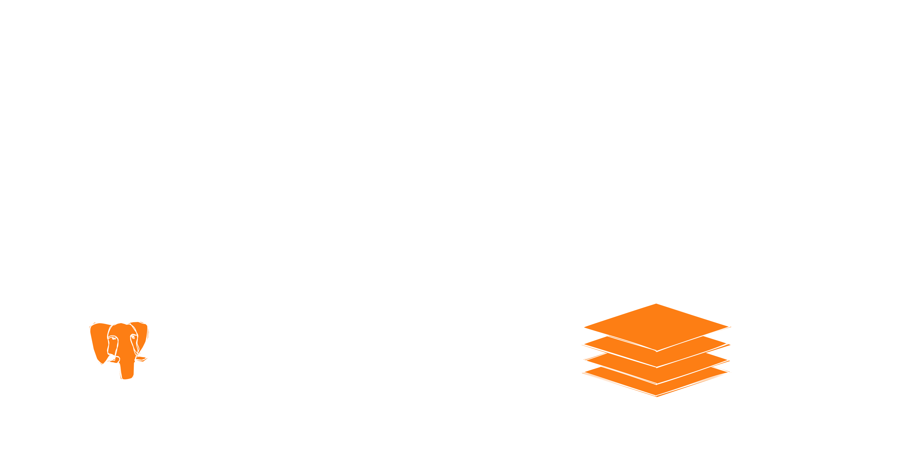

---
src: ./slides/introduction/myself.md
---


---
src: ./slides/introduction/workshop.md
---

---
src: ./slides/introduction/agenda.md
---

---
layout: center
transition: fade-out
class: text-center
---

# 📚 Theory

Why are we doing this?

---
layout: center
transition: fade-out
---

<LightOrDark>

  <template #light></template>

  <template #dark></template>

</LightOrDark>

---
src: ./slides/theory/today.md
---

---
layout: statement
transition: fade-out
---

# Is there no abstraction? 😭

<v-click>

## There is!

</v-click>

---
src: ./slides/theory/acorn.md
---

---
layout: center
transition: fade-out
---


<div class="abs-b text-2 text-gray-400">Image taken from docs.acorn.io</div>

---
layout: center
transition: fade-out
class: text-center
---

# ⚙️ Preparations

First things first!


---
src: ./slides/theory/installation.md
---

---
src: ./slides/theory/repository.md
---

---
layout: center
transition: fade-out
class: text-center
---

# 🚀 Test Run

Let's see what we're working with

<br />

<br />

```bash
docker compose up 
```

---
layout: center
transition: fade-out
---

<LightOrDark>

  <template #light></template>

  <template #dark></template>

</LightOrDark>

---
layout: center
transition: fade-out
class: text-center
---

# 🏗️ First Steps

Acorn Fundamentals

<br />

<br />

```bash 
git checkout section-01
```

---
src: ./slides/practical/section-01/database-static.md
---

---
src: ./slides/practical/section-01/redis-static.md
---

---
src: ./slides/practical/section-01/guestbook-static.md
---

---
src: ./slides/practical/section-01/takeaways.md
---

---
layout: center
transition: fade-out
class: text-center
---

# 🔁 Iterate

Utilizing dependencies and probes

<br />

<br />

```bash 
git checkout section-02
```

---
src: ./slides/practical/section-02/dependencies-static.md
---

---
src: ./slides/practical/section-02/probes-static.md
---

---
src: ./slides/practical/section-02/takeaways.md
---

---
layout: center
transition: fade-out
class: text-center
---

# 🔁 Iterate

(Secret) data management

<br />

<br />

```bash 
git checkout section-03
```

---
src: ./slides/practical/section-03/secrets-static.md
---

---
src: ./slides/practical/section-03/volumes-static.md
---

---
src: ./slides/practical/section-03/takeaways.md
---

---
layout: center
transition: fade-out
class: text-center
---

# 🔁 Iterate

User-provided configuration

<br />

<br />

```bash 
git checkout section-04
```

---
src: ./slides/practical/section-04/args-static.md
---

---
src: ./slides/practical/section-04/takeaways.md
---


---
layout: center
transition: fade-out
class: text-center
---

# ✨ Finishing Touches

Build, push, and deploy the Acorns

<br />

<br />

```bash 
git checkout section-05
```

---
src: ./slides/practical/section-05/deploy.md
---

---
layout: center
transition: fade-out
class: text-center
---

# 🎭 Encore

Some more things Acorn can do...

---
src: ./slides/practical/section-05/demo.md
---

---
src: ./slides/end/pros.md
---

---
src: ./slides/end/cons.md
---


---
layout: center
transition: fade-out
class: text-center
---

# 🎬 Cut!

Thanks for attending!

---
src: ./slides/end/thanks.md
---

---
layout: center
transition: fade-out
class: text-center
---

# ❓ Questions

<div class="abs-b pb-16 text-4 text-gray-400">

Feel free to leave feedback at [guestbook.dbodky.me](https://guestbook.dbodky.me)

</div>
