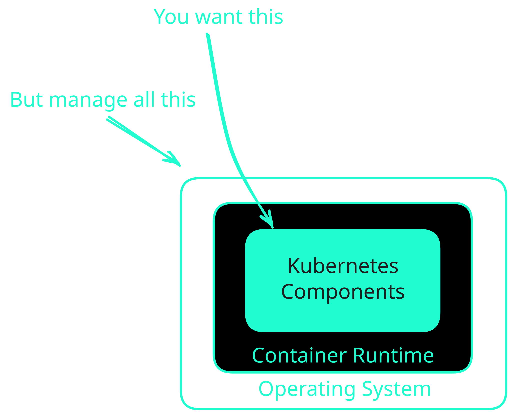
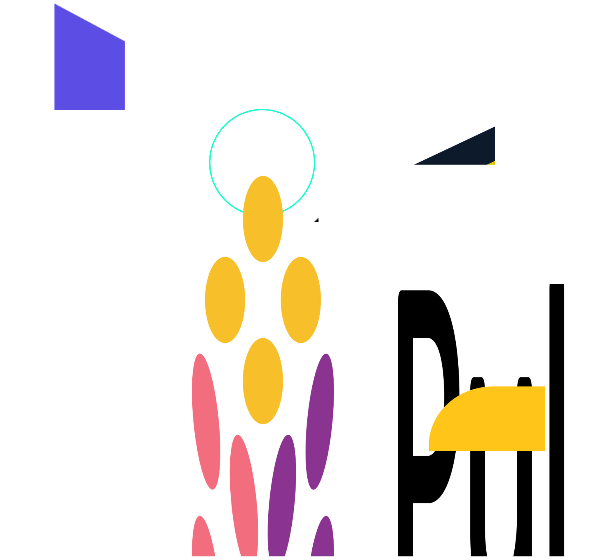
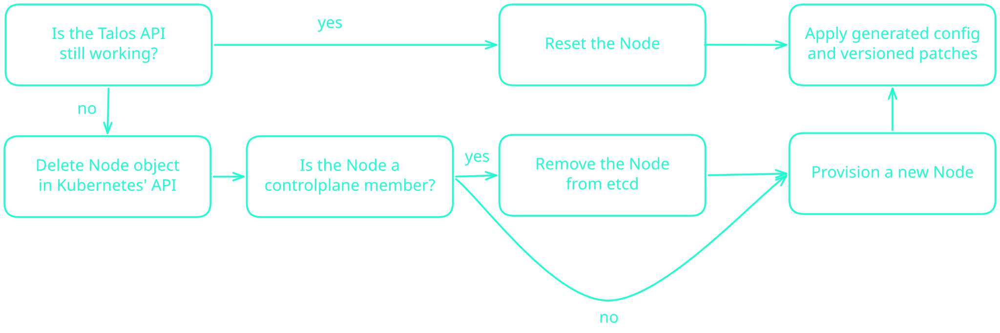
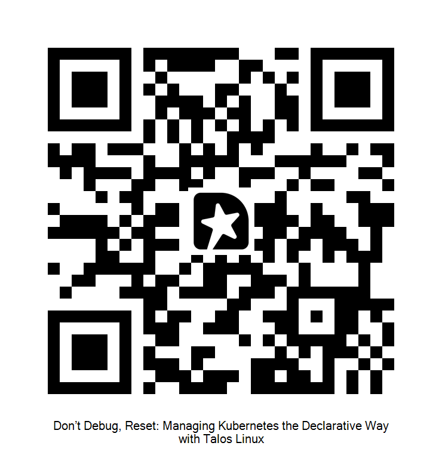

---
layout: section
---

# What Do We Need for Running Kubernetes?

---
layout: two-cols
---

# Kubernetes is Layered

## We Operate and Manage Vertical Stacks

::left::

- Operating systems
- Container runtimes
- Kubernetes components
  - `kubelet`
  - `kube-apiserver`
  - `kube-scheduler`
  - `kube-controller-manager`

::right::



---

# Each Layer Adds Operational Tasks

## These Might Sound Familiar

- OS Updates
- CVE Patches
- Kernel configuration
- User management
- Kubernetes upgrades
- Static pod configuration
- Hardening

---

# There's a Tool for That!

## Or Many...



---
layout: section
---

# Isn't there a simpler way?

---
layout: two-cols
---

# About Me

::left::

- Senior Platform Advocate at **NETWAYS Web Services**
- Main interests
  - Kubernetes
  - Observability
  - GitOps
- Running a homelab based on Kubernetes<br/>
  <v-click>...including all the production nightmares</v-click>

::right::

<div class="h-full flex flex-col justify-center">
  
</div>

---
layout: quote
---

# Talos Linux is a Kubernetes optimized Linux distro. It does one thing and it does it better than any general purpose Linux distribution.

## \- From the [Talos documentation](https://docs.siderolabs.com/talos/v1.13/overview/what-is-talos)


---

# Talos at a Glance

## What Does It Do Differently?

Talos is...

- **minimal**<v-click>: the OS image is **<80MB in size**.</v-click>
- **immutable**<v-click>: Talos runs from a **SquashFS image**, writes go to an **ephemeral partition**.</v-click>
- **secure**<v-click>: **no SSH, no shell**, key-encrypted communication only.</v-click>
- **declarative**<v-click>: everything is configured through **a single YAML manifest**.</v-click>

---
layout: section
---

# Let's check against these claims

---

# Minimalism

## How Talos is Packaged and Distributed

Talos is...

- a container-optimised OS
- _not_ based on another Linux distribution
- built almost entirely from scratch in Golang
- available for many scenarios and architectures:
  - Bare-Metal
  - Cloud VMs
  - Single Board Computers (SBCs)

<span class="text-gray">

Boot assets for all supported scenarios are available on [factory.talos.dev](https://factory.talos.dev).

</span>

---

# Immutability

## How Talos Separates Files on Your System

- **dedicated partitions**: EFI, BIOS, BOOT, META, STATE, EPHEMERAL.
- **read-only root filesystem**: SquashFS, mounted into memory as loop-device.
- **tmpfs for runtime needs**: written to `/system`, bind-mounted into place, recreated on boot.
- **overlayfs for persistent data**: e.g. for Kubernetes and etcd, backed by XFS.

<span class="text-gray">

This three-tier layout allows Talos to make specific files writable while keeping the system locked down.

</span>

---

# Security

## How Talos is Secured

- **no SSH, no shell**: interaction with Talos happens exclusively via API.
- **gRPC-based communication**: between different components of the OS.
- **no passwords**: authentication & authorization happens through certificates.
- **<50 binaries**: Talos' minimalism can prevent many published vulnerabilities.

---

# Security

## How Talos is Secured

```sh
# Lists all unique binaries on a Talos system
talosctl ls -t f -n 192.168.1.11 /usr/bin | tail -n +2 | awk '{print $2}' | paste -sd, -

  apparmor_parser,containerd,containerd-shim-runc-v2,cryptsetup,dashboard,dmsetup,e2fsck,fatlabel,fsck.fat,init,
  integritysetup,lvm,mke2fs,mkfs.fat,mkfs.xfs,modprobe,nft,pigz,poweroff,resize2fs,runc,shutdown,tune2fs,udevadm
  unpigz,veritysetup,xfs_copy,xfs_db,xfs_estimate,xfs_fsr,xfs_growfs,xfs_io,xfs_logprint,xfs_mdrestore,xfs_quota,
  xfs_repair,xfs_rtcp,xfs_scrub,xfs_spaceman,xtables-legacy-multi,xtables-nft-multi


# Counts all unique binaries on a Talos system
talosctl ls -t f -n 192.168.1.11 /usr/bin | wc -l

  42
```

<span class="text-gray">

Commands executed 2026-06-02 on Talos v1.13.2.

</span>

<style> 

.slidev-code-wrapper {
  @apply max-w-full;
}

</style>

---

# Declarative Model

## How Talos is Managed

- One YAML manifest to configure everything
- Extendable through strategic merge patches
- Pinnable to Kubernetes/Talos versions for reproducability
- Some things you can configure:
  - Disks, partitions, and network stack
  - Versions of Kubernetes components
  - Kubernetes feature gates and API parameters
  - Custom containerd configuration
  - Static Kubernetes manifests

---
layout: section
---

# The Talos CLI

---

# The Talos CLI

## How to Interact With Talos

`talosctl` is used for any kind of interaction with a Talos cluster:

- Bootstrapping
- Applying configuration
- Updating
- Debugging
- Generating `kubeconfig` etc.

---

# The Talos CLI

## How to Interact With Talos

`talosctl` provides **~50** commandlets for different purposes:

- managing clusters: `bootstrap`, `apply-config`, `upgrade`/`upgrade-k8s`
- troubleshooting and debugging: `status`, `health`, `debug`, `logs`, `pcap`
- system-level insights: `dmesg`, `memory`, `stats`, `usage`, `dashboard`

This allows interaction with Talos nodes and clusters from local environments, CI/CD, jumphosts, etc.

---
layout: section
---

# The Basics

## Common Administration Tasks on Talos Linux

---

# Common Administration Tasks

## Back to the Beginning...

- OS Updates <v-click><span class="m-l-40">➡️ `talosctl upgrade`</span></v-click>
- CVE Patches <v-click><span class="m-l-38.5">☑️ significantly lower risk due to Talos' slim architecture</span></v-click>
- Kernel configuration <v-click><span class="m-l-21.5">➡️ `talosctl apply-config`</span></v-click>
- User management <v-click><span class="m-l-24.5">☑️ no passwords, no shell, no user accounts</span></v-click>
- Kubernetes upgrades <v-click><span class="m-l-19">➡️ `talosctl upgrade-k8s`</span></v-click>
- Static pod configuration <v-click><span class="m-l-13.5">➡️ `talosctl apply-config`</span></v-click>
- Hardening <v-click><span class="m-l-42.5">➡️ `talosctl apply-config` (for Kubernetes)</span></v-click>

---

# Example

## Using `talosctl` to Bootstrap a Talos Cluster


A typical workflow for bootstrapping a cluster, using `talosctl`:

<v-click>

1. Generate secrets: `talosctl gen secrets ...`

</v-click>
<v-click>

2. Generate configuration: `talosctl gen config --with-secrets ...`

</v-click>
<v-click>

3. Patch configuration: `talosctl patch ...`

</v-click>
<v-click>

4. Apply configuration: `talosctl apply-config ...`

</v-click>
<v-click>

5. Bootstrap the cluster: `talosctl bootstrap ...`

</v-click>
<v-click>

6. Generate `kubeconfig`: `talosctl kubeconfig ...`

</v-click>

---
layout: center
---

# OS Upgrades on Talos

<SlidevVideo class="max-h-110" controls>
  <source src="./public/talos-upgrade.mp4" type="video/mp4"/>
</SlidevVideo>

---
layout: center
---

# Kubernetes Upgrades on Talos

<SlidevVideo class="max-h-110" controls>
  <source src="./public/k8s-upgrade.mp4" type="video/mp4" />
</SlidevVideo>

---
layout: section
---

# Don't Debug, Reset

## Disaster Recovery the Talos Way

---

# Cattle, not Pets

## When a Talos Node Breaks, This Becomes the Playbook




---
layout: section
---

# Takeaways

## What to Remember After This Talk

---

# Best Practices

## What to Keep in Mind When Managing Talos Clusters

- Five things to save/note down:
  - cluster name
  - cluster endpoint
  - `secrets.yaml`
  - Kubernetes version
  - Talos version
- Regenerate base config on-demand and treat as throw-away data
- Version patches and treat them as configuration artifacts.

---

# Before the First Incident

## Be Prepared

- Understand what `talosctl` can do.<br/>
  _Learn one tool, but learn it well._
- Walk through debugging scenarios on Talos (using `talosctl debug`)<br/>
  _Works the same as_ `kubectl debug`.
- Document machineconfigs, patches, and patch order.<br/>
  _Machineconfigs are your single source of truth._
- Understand what Talos does on its own and where you need to automate yourself
  - etcd memberships
  - Kubernetes updates
  - Node cordons/drains

---
layout: two-cols
---

# Thank You for Your Attention

## Any Questions?

::left::
- **Slides**:<br/>[slides.dbodky.me/cns-munich-2026](https://slides.dbodky.me/cns-munich-2026)
- **HowTos**:<br/>[dbodky.me/docs/kubernetes/talos/howtos](https://dbodky.me/docs/kubernetes/talos/howtos)
- **Docs**:<br/>[docs.siderolabs.com/talos](https://docs.siderolabs.com/talos)

::right::

<h2 class="text-center">Feedback via Sessionize</h2>



---
layout: image
image: /thankyou.svg
---
