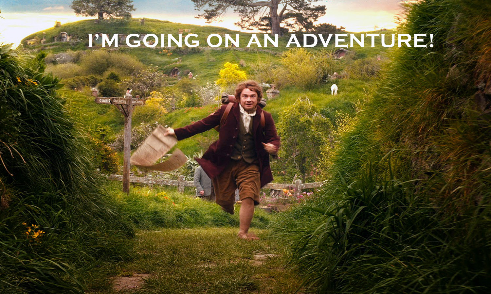
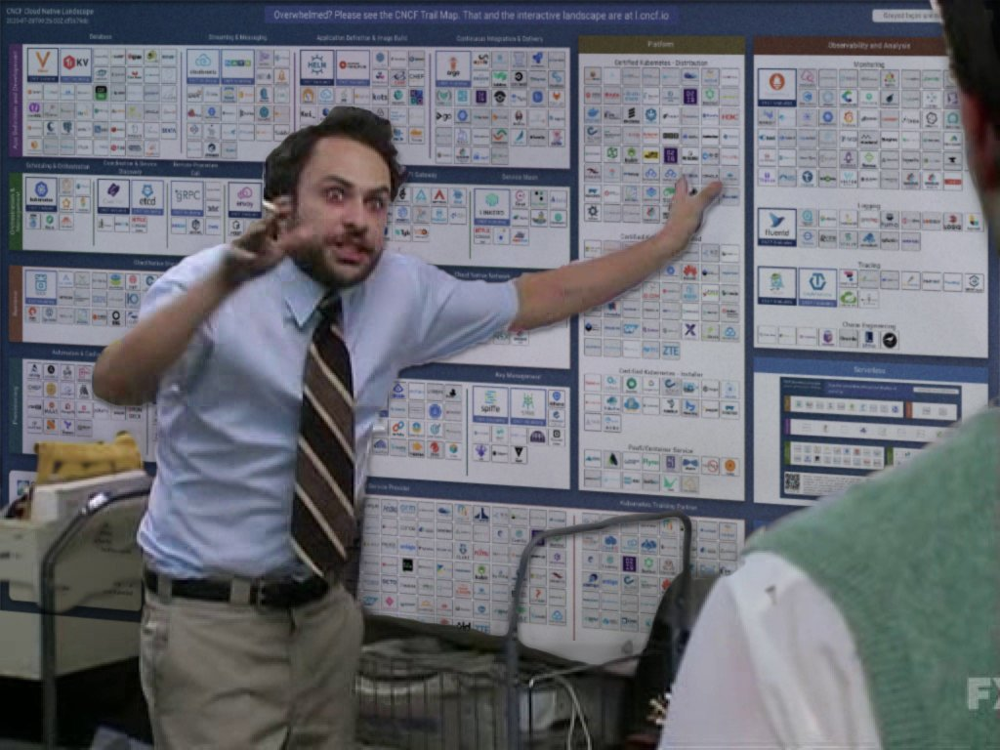
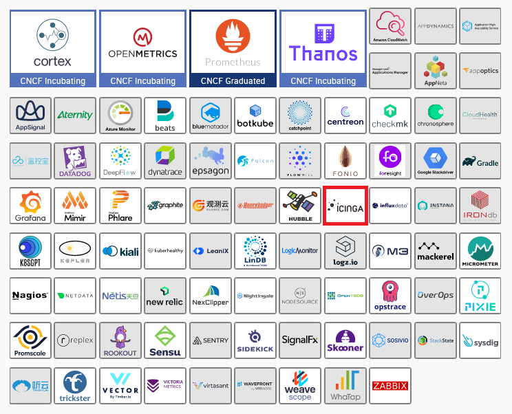
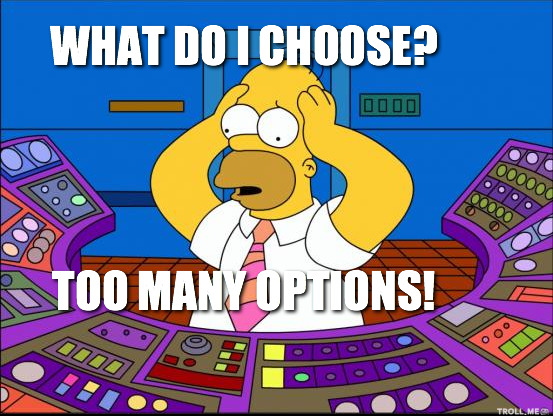
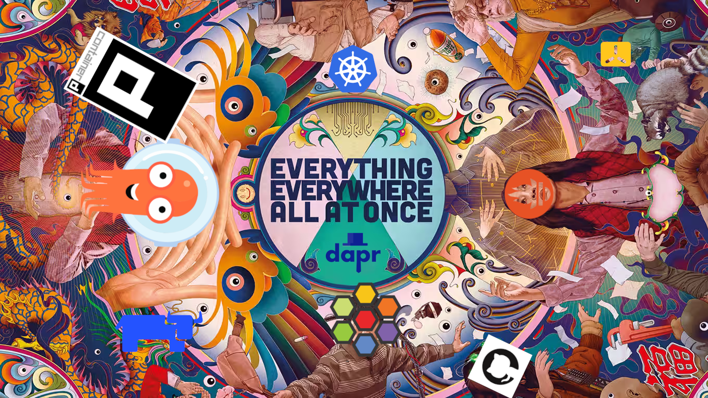

---
transition: fade-out
layout: two-cols
---

# About me

 

 

 

* Daniel Bodky from Germany

 

* Consultant, trainer and speaker at NETWAYS

 

* Working with cloud-native and DevOps-related technologies

::right::

 

 

 

---
transition: fade-out
layout: quote
---

# Shiny object syndrome is the situation where people focus undue attention on an idea that is new and trendy, yet drop this as soon as something new takes its place [...].

\- from Wikipedia

---
transition: fade-out
layout: default
---

# Learning new technology

---
transition: fade-out
layout: default
---

# Tools o' plenty

---
transition: fade-out
layout: default
---

# Spoilt for choice

---
transition: fade-out
layout: two-cols
---

# The paradox of choice

* Too many choices can lead to decision paralysis

* *more* becomes *less*

* People are afraid of making the wrong choice

::right::

---
transition: fade-out
layout: default
---

# SOS as a coping mechanism

* Keeps you distracted and chasing for the perfect solution

* 'Saves' you from making a decision

* Prevents you from getting started *anywhere*

---
transition: fade-out
layout: default
---

# Everything, everywhere, all at once

---
transition: fade-out
layout: default
---

# It doesn't work out...

---
transition: fade-out
layout: quote
---

# But what does work out?

Let's find a more sustainable way to adopt new technology.

---
transition: fade-out
layout: quote
---

# Split it up

What technology do I need to look at *right now*? What does my tool have to *do*?

---
transition: fade-out
layout: quote
---

# Start with the boring stuff

*Boring* often means *adopted*. Adopted means *supported*. Other parts of the puzzle will fall into place.

---
transition: fade-out
layout: quote
---

# Use the right tool for the right job

"Do I use a tool for its *core functionalities*?"

---
transition: fade-out
layout: quote
---

# Persist your findings

Take notes, discuss with colleagues, write blog posts, give talks.

---
transition: fade-out
layout: quote
---

# That's still SOS, with extra steps!

Yes, but...

---
transition: fade-out
layout: default
---

# Perks of SOS

* Knowing about existing alternatives

* Staying up-to-date with the latest developments

* Being able to make informed decisions

---
transition: fade-out
layout: quote
---

# Don't try to learn everything about something. Instead, try to learn something about everything.

\- Kunal Kushwaha

---
transition: fade-out
layout: quote
---

# It's not about getting rid of our curiosity (nor SOS), it's about leveraging it in a way that's sustainable in our daily lives.

---
layout: image-right
image: /thankyou.jpg
class: thankyoucontent
---

# Thank you!

 

Slides available at [https://slides.dbodky.me/devopsdays-amsterdam-2023](https://slides.dbodky.me/devopsdays-amsterdam-2023)
