---
transition: fade-out
layout: two-cols
---

# About me

<br />

<br />

* Consultant at NETWAYS since 2021

* Icinga user since 2018 (Icinga 2.10)

* moved on to DevOps, Kubernetes, and "the cloud"

* happy to be here today and bring it all together

<br />

<br />

Slides are available at<br /> [https://slides.dbodky.me/icingacamp-2023/](https://slides.dbodky.me/icingacamp-2023/).

::right::


---
layout: section
---
# Ins, Outs, and Expectations

---
layout: two-cols
---

# What I won't tell you

<br />

<br />

<br />

* instructions for production-ready Icinga2 on Kubernetes

* a complete introduction to containers, Docker, or Kubernetes

* a silver bullet for Icinga2 in HA mode

::right::

<div v-click=1>
<h1>What I will tell you</h1>

<br />

<br />

<br />

<ul>
<li><p>a short discussion of the tradeoffs of running Icinga2 in HA mode</p></li>

<li><p>my personal takes on Icinga2 and its components in HA mode</p></li>

<li><p>an introduction to Icinga's official Docker images for <b>Icinga2</b>, <b>Icingaweb2</b>, and <b>IcingaDB</b></p></li>

<li><p>a working example of Icinga2 on Kubernetes</p></li>
</ul>
</div>


---
layout: section
---

# What is HA?

---
layout: quote
---

# "High Availability (HA for short) refers to the availability of resources in a computer system, in the wake of component failures in the system."

\- Institute of Electrical and Electronics Engineers (IEEE)

---
layout: section
---

# So which components are there for Icinga2?

---
layout: default
---

<LightOrDark>
  <template #dark>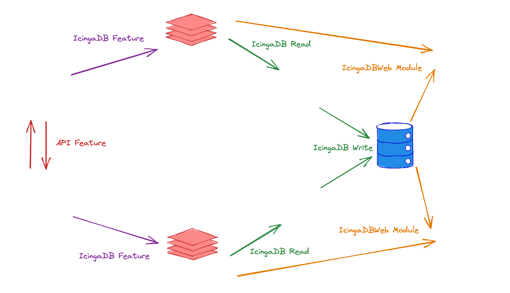</template>
  <template #light>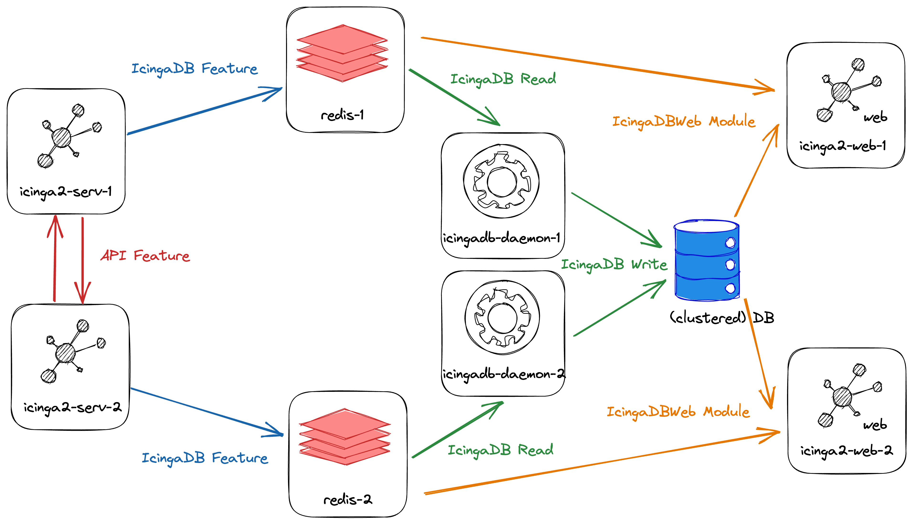</template>
</LightOrDark>

---
layout: default
---

# Component \#1: Icinga2 Core

<br />

<div grid="~ cols-2 gap-2" m="-t-2">
<ul><li><code>api</code> feature needs to be configured, along with a <code>zones.conf</code> configuration</li></ul><div></div>

<ul><li>Both nodes share scheduled checks within their zone, with automated failover</li></ul><div></div>

<ul><li>Both nodes communicate the shared, total state of the zone to each other</li></ul><div></div>

<ul><li>Several of Icinga2's features are HA-aware and -configurable, e.g. <code>icingadb</code>, <code>notifications</code>, <code>graphite</code>, or <code>influxdb</code></li></ul>

</div>

<LightOrDark>
  <template #dark>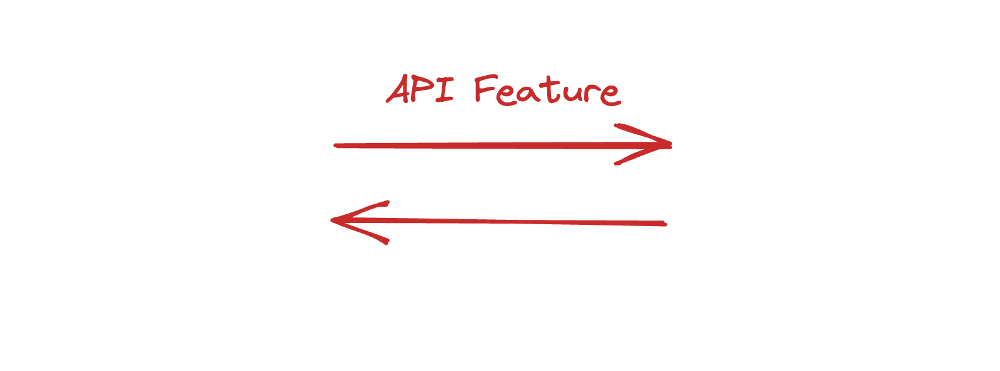</template>
  <template #light>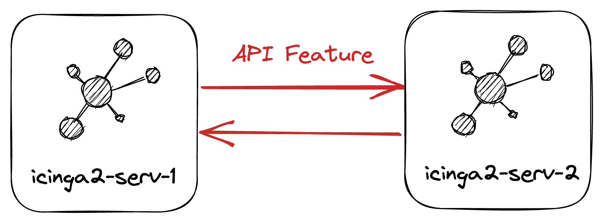</template>
</LightOrDark>

---
layout: default
---

# Component \#2: Redis

<LightOrDark>
  <template #dark>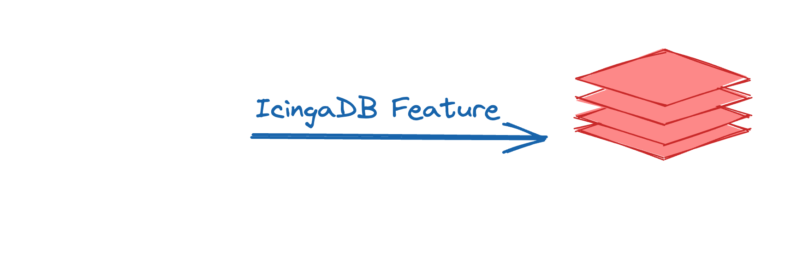</template>
  <template #light>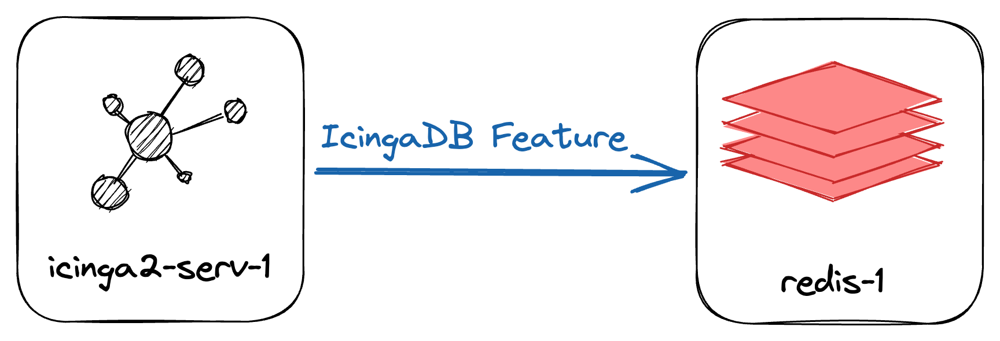</template>
</LightOrDark>

<br />

<br />

<br />

<br />

<div grid="~ cols-2 gap-2" m="-t-2">

<ul><li>One Redis instance per Icinga2 node</li></ul><div></div>

<ul><li>Icinga2 writes its state to Redis</li></ul><div></div>

<ul><li>Persistency is configured via snapshots</li></ul><div></div>

<ul><li>Those Redis instances are <b>not</b> clustered</li></ul><div></div>

</div>

---
layout: default
---

# Component \#3: IcingaDB

<LightOrDark>
  <template #dark>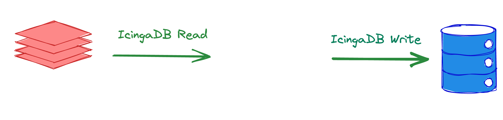</template>
  <template #light>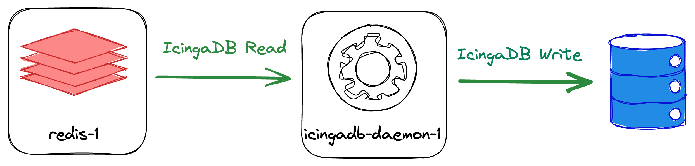</template>
</LightOrDark>

<br />

<br />

<br />

<div grid="~ cols-2 gap-2" m="-t-2">

<ul><li>One IcingaDB daemon per Icinga2 node</li></ul><div></div>

<ul><li>Each reads from its own Redis instance</li></ul><div></div>

<ul><li><b>Both</b> write to <b>the same</b> database</li></ul><div></div>

<ul><li>Only one daemon writes to the database at a time</li></ul><div></div>

<ul><li>HA aware, with support for failover</li></ul><div></div>

</div>

---
layout: default
---

# Component \#4: Database(s)

<br />

* Persists various information about our monitoring environment
  * History for checks, notifications, downtimes, etc. (`IcingaDB`)
  * Users, groups, memberships, etc. (`Icingaweb2`)
  * Configuration (`Director`)
  * Additional data from modules (`vspheredb`, `reporting`, etc.)

* Writes are done by IcingaDB

* Reads are done by Icingaweb2

* High available?

<LightOrDark>
  <template #dark>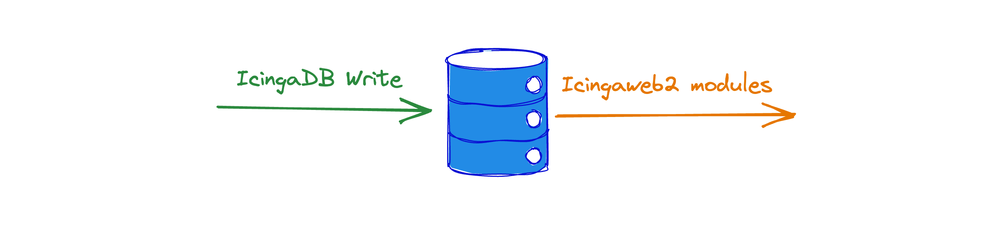</template>
  <template #light></template>
</LightOrDark>

---
layout: default
---

# Component \#4: Database(s)

<br />

<br /> 

* Running databases in HA is difficult

* Different possible deployment strategies for different database vendors:
  * Failing over to stand-by replica
  * Master/Slave replication
  * Master/Master replication
  * Clustering (e.g. Galera, Patroni)
  * Distributed databases (Cassandra, Cockroach DB)

* "*keep it simple*" is a good rule of thumb

---
layout: default
---

# Component \#5: Icingaweb2

* Reads from Redis, reads and writes from/to the database

* **Easy**: "just" a PHP web application

* **But**:
  * writes local configuration
  * uses **sessions** for authenticated users
  * provides modules with **daemons** which need to be made HA-aware (e.g. `vspheredb`)

* Again, 3rd-party tools will be needed for HA support

<LightOrDark>
  <template #dark>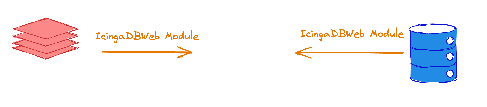</template>
  <template #light></template>
</LightOrDark>

---
layout: default
---

# Summing it up...

<br />

* Icinga2 in HA involves:
  * Lots of moving parts within Icinga's stack
  * Lots of moving parts **around** Icinga's stack (load balancers, vIPs, file sync, etc.)
  * Lots of expertise in very different areas (database, web servers, etc.)

* With HA, new challenges arise:
  * "Split Brain"
  * Maintainability
  * Error proneness

---
layout: quote
---

# "Do you need high<span style="color: #f79b23">est</span> availability or high<span style="color: #f79b23">er</span> availability?"

\- Colleagues and I, quite often

---
layout: default
---

# What if...

<br />

<br />

* ...we don't need 100% uptime for our Icinga node(s)?

<br />

* ...our Icinga2 nodes were **stateless**?

<br />

* ...we could just **throw away** a node and **spin up** <br /> a new one in case of failure?

<br />

* ...we could get rid of load balancers, service <br /> discovery, and file sync?


---
layout: section
---

# Containers

---
layout: two-cols

---

# What are containers?

<br />

* Ephemeral (short-lived) instances of an application

* Based on images

* Image ship dependencies, configuration, and code

* "Build once, run (almost) anywhere"

* Can be run in isolation or in groups

* Operated by a container runtime (e.g. Docker, Podman)

::right::

<br />

<br />


<LightOrDark>
<template #light>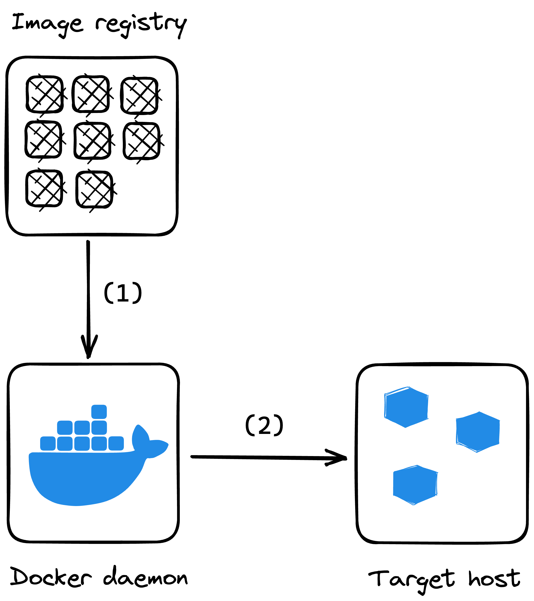</template>
<template #dark>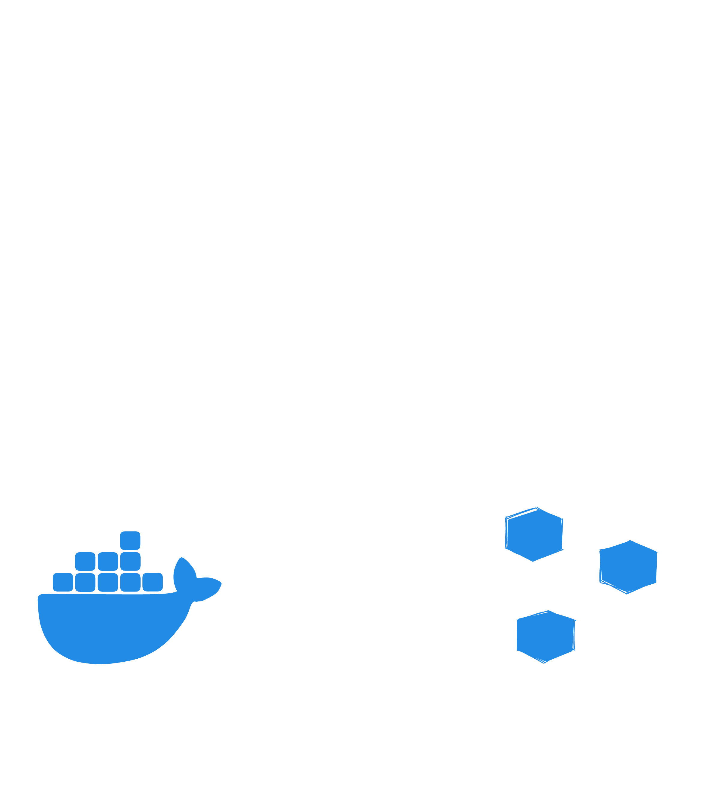</template>
</LightOrDark>

<br />

```console
$ docker pull icinga/icinga2:2.11.4  # (1)
$ docker run icinga/icinga2:2.11.4   # (2)
```

---
layout: section
---

# Does Icinga provide container images?

<v-click>
<h1>Yes!</h1>
</v-click>

---
layout: default
---

# Icinga's container images

<br />

* Icinga provides containers for all of its main components on **DockerHub** (a *registry*):
  * Icinga2 - `icinga/icinga2`
  * Icingaweb2 - `icinga/icingaweb2`
  * IcingaDB - `icinga/icingadb`
  * Director (via Icingaweb2) - `icinga/icingaweb2`

* Other needed components can be found on **DockerHub** as well:
  * PostgreSQL - `postgres`
  * MySQL/MariaDB - `mariadb`
  * Redis - `redis`

---
layout: two-cols
---

# Icinga2 image

<br />

* Runs Icinga2 on `amd64`, `arm64`, and `armv7`

* Can be used to run
  * Masters
  * Satellites
  * Agents

* **Mostly** configurable via environment variables

* Additional configuration can be mounted from the host system

::right::
<br />

<br />

<br />

<br />

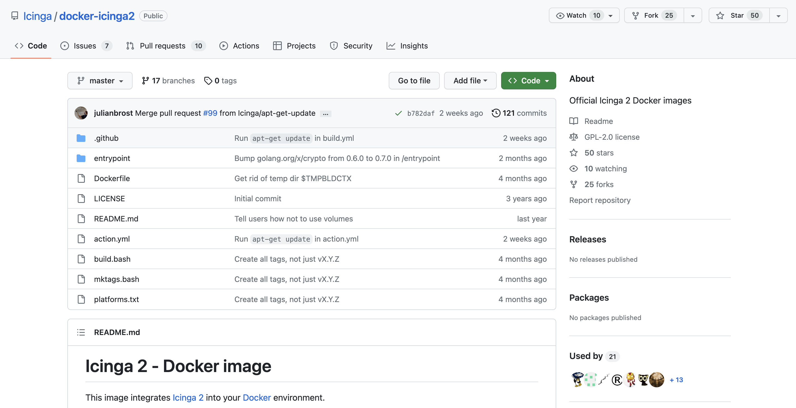

---
layout: two-cols
---

# Icingaweb2 image

<br />

* Runs Icingaweb2 on `amd64` (works on `arm64` and `armv7` as well)

* **Completely** configurable via environment variables thanks to a wrapper script

* Provides **all** supported Icingaweb2 modules

* Additional configuration can be mounted from the host system

* Modules with **daemons** (e.g. `director`) can be run by adjusting the container's startup routine

::right::
<br />

<br />

<br />

<br />

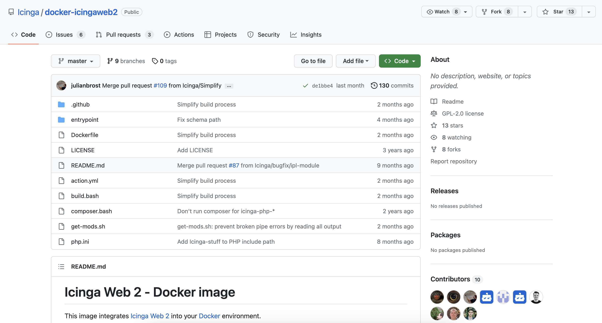

---
layout: two-cols
---

# IcingaDB image

<br />

<br />

<br />

* Runs IcingaDB on `amd64` (not yet on `arm64` and `armv7` 🙁)

* **Completely** configurable via environment variables thanks to a wrapper script

* Database migrations need to be done manually

::right::
<br />

<br />

<br />

<br />

<br />

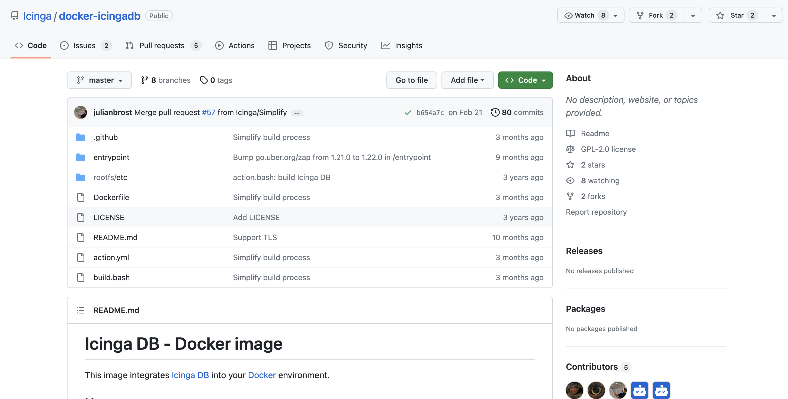

---
layout: default
---

# Gluing it all together

* Running these containers requires configuration for<br /> each of them

* Optimally, we don't want to do this manually

* **docker compose** is a plugin to Docker that allows us<br />to define and configure multi-container applications once<br/> and run them anywhere

* There's a repository by Icinga's Eric Lippmann that provides <br />a `docker-compose` setup for an entire Icinga stack:<br /> <br />[`lippserd/docker-compose-icinga`](https://github.com/lippserd/docker-compose-icinga)

<br />

<v-click>
<b>Perfect for experimenting with Icinga2 locally or small (home) setups!</b>
</v-click>

---
layout: default
---

# Containers, but better?

<br />

<br />

Containers, Docker, and compose are great, but still have some shortcomings:

* What if our host goes down?

<br />

* No load-balancing or traffic management

<br />

* Data gets persisted on the host system (if configured)

<br />

<v-click>
<b>For better resilience, a multi-node solution with less "locality" would be nice.</b>
</v-click>

---
layout: two-cols
---

# Kubernetes

<br />

<br />

* A container orchestration platform

* Connects multiple nodes to a cluster

* Runs container workloads on the nodes

* Monitors the health of nodes and containers

* Automatically schedules containers to healthy nodes

* Provides load-balancing and traffic management

::right::
<br />

<br />

<br />

<br />

<br />


---
layout: default
---

# Icinga2 on Kubernetes

<br />

* We got our prerequisites:
  
    * Container images ✅
  
    * A container orchestration platform ✅

* Now we need to define our application's deployment

* Kubernetes uses **declarative** configuration

* We define our application in **manifests**

* This can become quite complex, so we'll use a tool to help us

---
layout: default
---

# Helm - Kubernetes' inofficial package manager

<br />

<br />

* Helm is a tool that helps us manage Kubernetes applications

* It provides a templating engine for Kubernetes manifests

* It allows us to define our application in a **chart**

* Charts can be shared in repositories

* Configuration can be done via **values**

<br />

<br />

<v-click><b>We created a chart for Icinga2!</b></v-click>


---
layout: two-cols
---

# A home for Icinga charts

<br />

* Icinga's Helm chart(s) are hosted on GitHub: [icinga/helm-charts](https://github.com/icinga/helm-charts)

* Today, there's one chart: `icinga-stack`

* It can deploy:
  * Icinga2
  * IcingaDB
  * Icingaweb2 (+ modules and daemons)
  * MariaDB (optional)
  * Redis (optional)

::right::

<br />

<br />

<br />

<br />

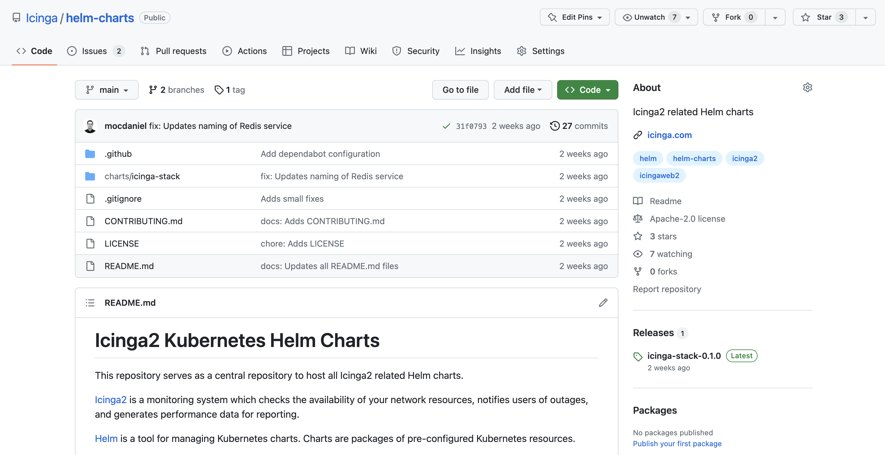

---
layout: section
---

# Time for a demo!

---
layout: default
---

# What did we see?

<br />

<br />

* We deployed a complete Icinga2 stack on Kubernetes

* We used a Helm chart to do so

* The chart is highly (and easily) configurable
  * on the application level
  * on the Kubernetes level

* Failover is handled by Kubernetes with minimal downtime

* Integrates with other Kubernetes services by design (e.g. Ingress, cert-manager)

---
layout: default
---

# What did we not see?

<br />

<br />

* Icinga(web)2 modules/configuration?
  * Left out on purpose, but can be configured
  * Helm chart ships with sane defaults
  * Some features and modules are not available (on purpose)

* Custom check plugins?
  * Not part of the Helm chart
  * Can be added to the container image
  * Can be mounted into the container

---
layout: default
---

# Next steps

<br />

<br />

<br />

* "Configuration as Code" approach to module configuration (e.g. `businessprocess`)

<br />

<br />

* Integration of pre-existing secrets (e.g. for databases etc.)

<br />

<br />

* More docs and examples for the Helm chart

---
layout: default
---

# Takeaways and final thoughts

<br />

<br />

* Monitoring with Icinga2 does not have to provide "highest availability"<br /> in most scenarios

<br />

* Icinga2 can be run in containers (and Kubernetes!)

<br />

* Depending on your use case, this can be a viable option for parts <br /> of your monitoring infrastructure

<br />

* The **compose** project and Helm chart are great starting points

---
layout: image-right
image: /thankyou.jpg
class: thankyoucontent
---

# Thank you!

<br />

Slides available at [https://slides.dbodky.me/icingacamp-2023](https://slides.dbodky.me/icingacamp-2023)
