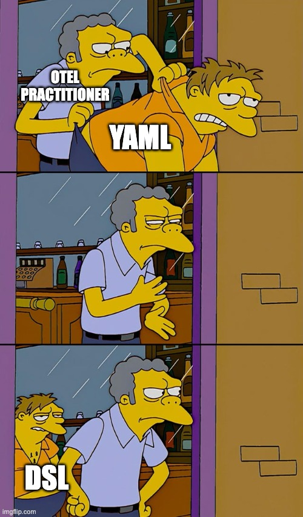
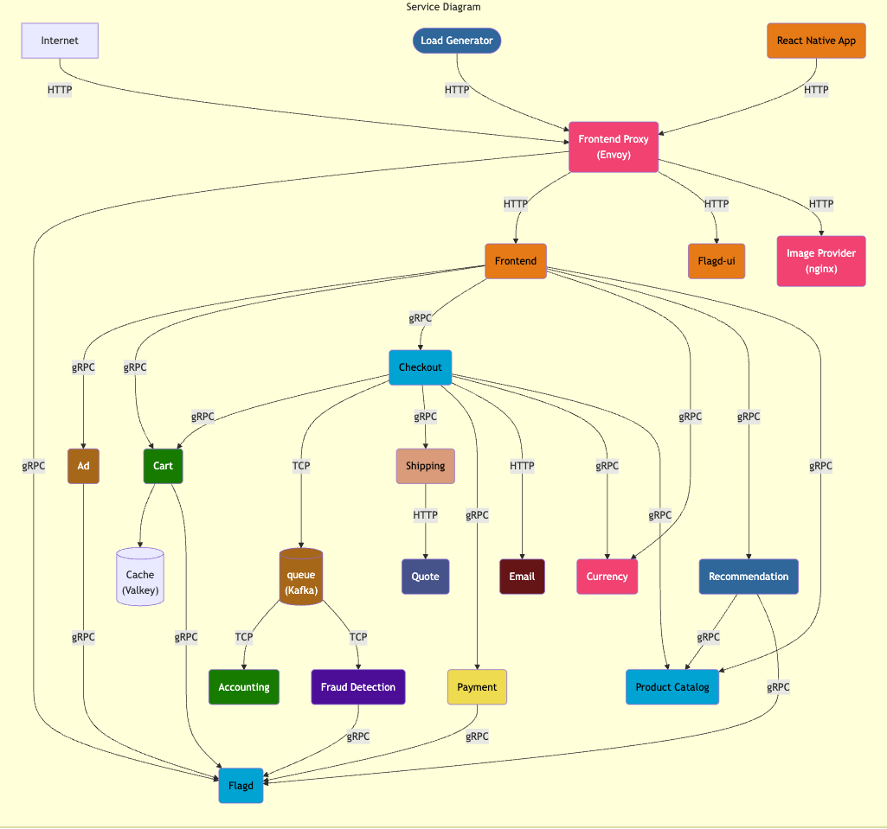

# Ahoj Alloy!

How Grafana Alloy Can Transform Your Open Telemetry Journey

<div class="mt-12 py-1">
  KCD Czech&Slovak <br/>
  June 5, 2025
</div>


---
layout: statement
---

# 🤔 Can I...?

...just plug Grafana Alloy into the OTel demo?

---
layout: two-cols
---

# About Me

Who's this guy?

<br />

- DevRel and CNCF Kubestronaut from Germany 🇩🇪
- **@ NETWAYS Web Services**, a German MSP
- Especially interested in GitOps and Infrastructure as Code
- In my free time, I...
  - ...build small web apps
  - ...tinker with my homelab
  - ...learn about OpenTelemetry

::right::

<div class="h-full flex flex-col justify-center">
  
</div>

---
layout: section
---

# ❓ What Is OpenTelemetry?

A short introduction

---
layout: two-cols
---

# OpenTelemetry (OTel)

An open observability standard

<br />
<br />

- Open-Source **Observability framework**
- Provides **tools, APIs**, and **SDKs** to **collect, process**,
  and **export** telemetry data
- **Vendor-Neutral** and **standardized**
- **Tracks** and **communicates** progress of the project's components on the [OpenTelemetry website](https://opentelemetry.io)

::right::

<div class="h-full flex flex-col justify-center">
  
</div>

---
layout: section
---

# 🚦 OTel Signals

What can we observe?

---
layout: two-cols
---

# OTel Metrics

Measure all the things

- A measurement captured at runtime, containing...
  - ...the **measurement** itself
  - ...the **time** it was captured
  - ...associated **metadata**

- The type of this measurement can be...
  - ...a `Counter`
  - ...an `UpDownCounter`
  - ...a `Gauge` 
  - ...a `Histogram`

::right::

<div class="m-l-4 h-full flex flex-col justify-center">

| Status | Language |
|----------|--------|
| **Stable** | <vscode-icons-file-type-cpp3 /> <vscode-icons-file-type-csharp2/> <vscode-icons-file-type-go/> <vscode-icons-file-type-java/> <vscode-icons-file-type-js-official/> <vscode-icons-file-type-php/> <vscode-icons-file-type-python/>|
| **Beta** | <vscode-icons-file-type-light-rust/> |
| **Development** | <vscode-icons-file-type-erlang/> <vscode-icons-file-type-elixir/> <vscode-icons-file-type-ruby/> <vscode-icons-file-type-swift/> |

[Learn more](https://opentelemetry.io/docs/concepts/signals/metrics/#language-support)

</div>

<style>
  .slidev-icon {
    @apply w-10 h-10;
  }

  .footnotes {
    @apply absolute bottom-8;
  }
</style>

---
layout: two-cols
---

# OTel Logs

'Write that down!' - and read it

<br />
<br />

- A timestamped text record, containing...
  - **structured** (recommended), **semistructured**, or **unstructured** information
  - optional **metadata**
- Can be correlated with **traces**
- Designed to be **fully compatible** with **existing solutions**

::right::

<div class="m-l-4 h-full flex flex-col justify-center">

| Status | Language |
|----------|--------|
| **Stable** | <vscode-icons-file-type-cpp3 /> <vscode-icons-file-type-csharp2/> <vscode-icons-file-type-java/>  <vscode-icons-file-type-php/> |
| **Beta** | <vscode-icons-file-type-go/> <vscode-icons-file-type-light-rust/> |
| **Development** | <vscode-icons-file-type-erlang/> <vscode-icons-file-type-elixir/> <vscode-icons-file-type-js-official/> <vscode-icons-file-type-python/> <vscode-icons-file-type-ruby/> <vscode-icons-file-type-swift/> |

[Learn more](https://opentelemetry.io/docs/concepts/signals/logs/#language-support)

</div>

<style>
  .slidev-icon {
    @apply w-10 h-10;
  }

  .footnotes {
    @apply  absolute bottom-8;
  }
</style>

---
layout: two-cols
---

# OTel Traces

Track user interactions

- A **big picture** of what's happening
- Represented as `Spans`
- Parent/Child/Sibling relations between `Spans` 

```json
{
  "name": "hello-salutations",
  "context": {
    "trace_id": "5b8aa5a2d2c872e8321cf37308d69df2",
    "span_id": "93564f51e1abe1c2"
  },
  "parent_id": "051581bf3cb55c13",
  "start_time": "2022-04-29T18:52:58.114492Z",
  "end_time": "2022-04-29T18:52:58.114631Z",
  "attributes": {
    "http.route": "some_route3"
  },
  "events": [...]
}
```

::right::

<div class="m-l-4 h-full flex flex-col justify-center">

| Status | Language |
|----------|--------|
| **Stable** | <vscode-icons-file-type-cpp3 /> <vscode-icons-file-type-csharp2/> <vscode-icons-file-type-erlang/> <vscode-icons-file-type-elixir/> <vscode-icons-file-type-go/> <vscode-icons-file-type-java/> <vscode-icons-file-type-js-official/> <vscode-icons-file-type-python/> <vscode-icons-file-type-php/> <vscode-icons-file-type-ruby/> <vscode-icons-file-type-swift/>  |
| **Beta** |  <vscode-icons-file-type-light-rust/> |

</div>

<style>
  .slidev-icon {
    @apply w-10 h-10;
  }

  .slidev-code {
    background-color: rgb(27, 27, 27);
  }
</style>

---
layout: two-cols
---

# OTel Profiles

Insights into performance and behavior

<br />

- Provide dynamic information about the **behavior** and **performance** of application code at **run-time**
- Allows for this information to be **stored**, **queried**, and **analyzed** over time
- Can be **linked** to logs, metrics, and traces
- Added as a new signal type in OTLP `v1.3.0`
- Still marked as unstable

::right::

<div class="h-full flex flex-col justify-center">
  
</div>

---

# OTel Instrumentation

SDKs and APIs

<br />

_For a system to be observable, it must be **instrumented**: that is, code from the system's components must emit signals, such as traces, metrics, and logs._ - [OTel Docs](https://opentelemetry.io/docs/concepts/instrumentation/)

<br />

- Two complementary strategies of instrumentation exist:
  - **Code-based**: deeper insights, rich telemetry from within the application itself
  - **Zero-code**: great for getting started or can't modify the application itself
- SDKs and APIs exist for various languages, in varying degrees of stability

---
layout: section
---

# 📥 OTel Collector

How can we process signals?

---
layout: two-cols
---

# OTel Collector

Where it all comes together

<br />

- **Receives, processes**, and **exports** telemetry data
- Vendor-agnostic
- Reduces overhead of operating multiple, signal-specific agents/collectors
- Takes care of additional tasks like...
  - ...**batching** of telemetry data
  - ...**retrying** failed forwarding to backends
  - ...**encrypting** telemetry data

::right::

<div class="h-full flex flex-col justify-center">
  
</div>

---

# OTel Collector


---

# OTel Distributions

Stand on the shoulders of giants

<br />
<br />

- **Customized version** of an OTel component
- Wrap an upstream OTel repository
- Introduce customizations, e.g. ...
  - ...**additional capabilities** (auth, config management, etc.)
  - ...changes to **default settings**
  - ...**vendor-specific** receivers or exporters

---
layout: section
---

# 🔭 Grafana Alloy

An OTel Collector Distribution

---
layout: two-cols
---

# Grafana Alloy

<br />

- Open-Source, announced in 2024
- Support for **metrics, logs, traces**, and **profiles**
- Built-in Prometheus optimizations
- Aims at being a _Big Tent_ collector for a multitude of observability solutions (open-source _and_ enterprise)
- Additional features, e.g.
  - Remote configuration
  - Secret Management
  - Sharding
  - Live Debugging

::right::

<div class="h-full flex flex-col justify-center">
  
</div>

---
layout: two-cols
---

# Alloy Configuration

Yet another DSL

- Alloy features its own **declarative configuration language**
- Similar to HashiCorp Configuration Language (HCL)
- Consists of **blocks, attributes**, and **expressions**
- Provides a **standard library** with utility functions
- Easier to read/write, can be validated
- Conversion of **YAML-based configs** (e.g. from the OTel Collector) is possible

::right::

<div class="h-full flex flex-col justify-center">
  
</div>

---
layout: two-cols
---

# Alloy DSL

A short overview

```hcl {all|1,18|2-8|7|3,11-16}
otelcol.receiver.otlp "otel_receiver" {
  grpc {
    endpoint = sys.env("OTEL_COLLECTOR_HOST") + ":4317"
  }

  http {
    endpoint = "otel-collector:4318"
  }

  output {
    metrics = [otelcol.exporter.otlphttp.prometheus]
    logs    = [
      otelcol.exporter.otlphttp.loki,
      otelcol.exporter.debug.debugger
    ]
    traces  = [otelcol.exporter.otlp.jaeger]
  }
}
```

::right::

<div class="h-full flex flex-col justify-start m-l-4 m-t-7">

Equivalent configuration of the OTel Collector:

```yaml {all|1,2|4-7|7|5}{at:1}
receivers:
  otlp:
    protocols:
      grpc:
        endpoint: ${env:OTEL_COLLECTOR_HOST}:4317
      http:
        endpoint: otel-collector:4318
```

<br />

<div v-click="[1,2]">

  Alloy's configuration is made up of `Blocks` for defining `Receivers`, `Exporters`, `Processors`,
  and general configuration.

</div>  
<div v-click="[2,3]">

  `Blocks` can be nested. This way, components can logically group certain settings.

</div>
<div v-click="[3,4]">

  `Blocks` can contain `Attributes`, which are either **required** or **optional**.

</div>
<div v-click="4">

  `Attributes` can take an `Expression`, e.g. a **string concatenation**, an invocation of
  a function from the **standard library**, or a **reference** to another component.

</div>
</div>

<style>
  .slidev-vclick-hidden {
    @apply h-0;
  }

  .slidev-code {
    background-color: rgb(27, 27, 27);
  }
</style>

---

# Alloy Components

Building blocks for OTel pipelines

<br />

- Each component performs a single task, e.g. ...
  - ...**receiving** data
  - ...**exporting** data
  - ...**manipulating** data
- Each component consists of...
  - ...**arguments** that configure the component's behavior
  - ...**outputs** that can be referenced by other components
- A large variety of official components are maintained by the Alloy team

[Learn more](https://grafana.com/docs/alloy/latest/reference/components/)

---
layout: section
---

# 💻 Demo Time

Let's see Alloy in action

---

# The Setup

What we are working with

The official [OTel demo](https://opentelemetry.io/docs/demo/) consists of a **webshop** application based on microservices.

<br />

It...

- ...runs on **Docker** or **Kubernetes**
- ...consists of **various microservices** written and instrumented in **various languages**
- ...processes **metrics, logs**, and **traces** using the **OTel collector**
- ...makes the processed telemetry available in **Grafana** and **Jaeger**

---



---
layout: section
---

# 🎓 Lessons Learned

What to make of this

---

# Summary

Making sense?

- Alloy is an OTel Collector Distribution allowing you to process _all_ telemetry signals<br />
  supported by OTel
- Alloy can interpret OTel Collector configuration in **YAML**, or leverage its own **DSL**
- Configuration is **component-based**, and pipelines are **DAGs** of **chained components**
- Alloy comes with **built-in features** for ...
  - ...**debugging**
  - ...**external configuration**
  - ...**clustering**
  - ...**compatibility**

---
layout: two-cols
---

# Thank You

I hope it was interesting

<br />
<br />

📊 **Slides**: [slides.dbodky.me/kcd-cz-sk-2025](https://slides.dbodky.me/kcd-cz-sk-2025)

<fa6-brands-github /> **Adjusted Demo**: [mocdaniel/opentelemetry-demo](https://github.com/mocdaniel/opentelemetry-demo)

📚 **Alloy Docs**: [grafana.com/docs/alloy](https://grafana.com/docs/alloy)

🌐 **Website**: [dbodky.me/#contact](https://dbodky.me/#contact)

👍 **Feedback**: [feedback.dbodky.me](https://feedback.dbodky.me) 

<div class="m-l-6 m-t--2" >

  Code: `CZSK-OTEL`

</div>

::right::

<div class="h-full flex flex-col items-center m-x-auto">

## Slides


## Feedback


</div>
