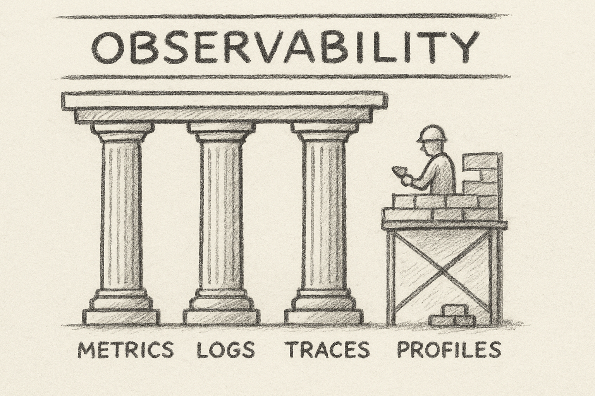
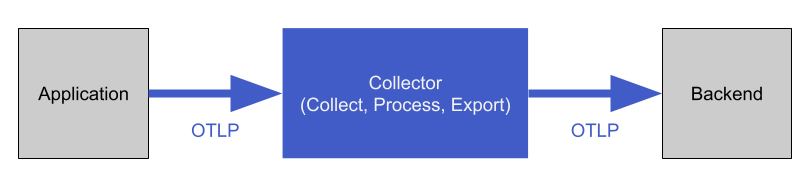
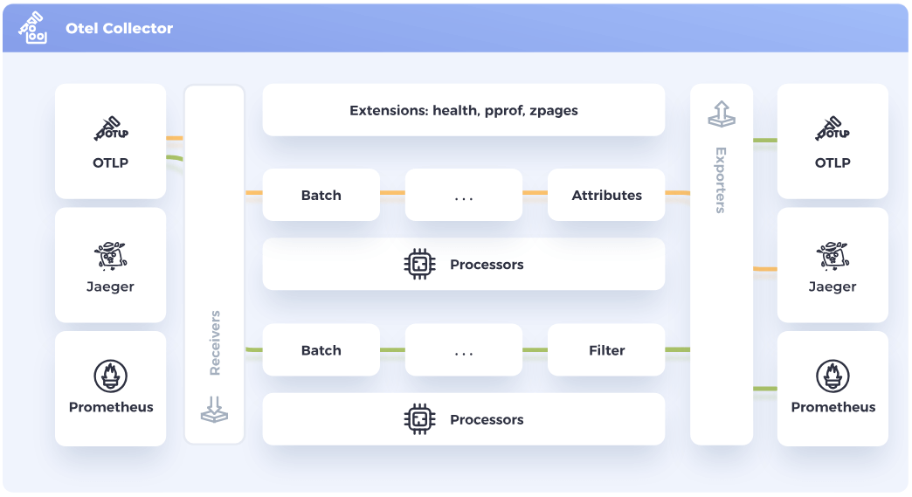

# Ahoy Alloy!

How Grafana Alloy Can Transform Your Open Telemetry Journey

<div class="mt-12 py-1">
  OpenTechDay 2025 Grafana Edition <br/>
  September 23, 2025
</div>


---
layout: statement
---

# 🤔 Can I...?

...just plug Grafana Alloy into the OTel demo?

---
layout: two-cols
---

# About Me

Who's this guy?

<br />

- Senior Platform Advocate from Germany 🇩🇪
- **@ NETWAYS Web Services**, a German MSP
- Especially interested in GitOps, Observability, IaC
- In my free time, I...
  - ...build small web apps
  - ...tinker with my homelab
  - ...learn about OpenTelemetry

::right::

<div class="h-full flex flex-col justify-center">
  
</div>

---
layout: section
---

# ❓ What Is OpenTelemetry?

A short introduction

---
layout: two-cols
---

# OpenTelemetry (OTel)

An open observability standard

<br />
<br />

- Open-Source **observability framework**
- Provides **tools, APIs**, and **SDKs** to **collect, process**,
  and **export** telemetry data
- **Vendor-neutral** and **standardized**
- **Tracks** and **communicates** progress of the project's components on the [OpenTelemetry website](https://opentelemetry.io)

::right::

<div class="h-full flex flex-col justify-center">
  
</div>

---
layout: two-cols
---

# OTel Signals

Measure all the things

<br />

<br />

- **Metrics** for capturing metrics at runtime
- **Logs** for capturing timestamped text records
- **Traces** for capturing user interactions and events across service components
- **Profiles** for capturing code-level application performance and behavior at run-time (_still under development_)

::right::

<div class="m-l-4 h-full flex flex-col justify-center">



<p class="p-l-4 text-size-xs text-slate-400">Image generated by AI.</p>

</div>

---
layout: center
---

# Stability Overview Per Signal

| Signal | Stable | Beta | Development |
|----------|--------|-------|---|
| **Metrics** | <vscode-icons-file-type-cpp3 /> <vscode-icons-file-type-csharp2/> <vscode-icons-file-type-go/> <vscode-icons-file-type-java/> <vscode-icons-file-type-js-official/> <vscode-icons-file-type-php/> <vscode-icons-file-type-python/>|<vscode-icons-file-type-light-rust/> | <vscode-icons-file-type-erlang/> <vscode-icons-file-type-elixir/> <vscode-icons-file-type-ruby/> <vscode-icons-file-type-swift/> |
| **Logs** | <vscode-icons-file-type-cpp3 /> <vscode-icons-file-type-csharp2/> <vscode-icons-file-type-java/>  <vscode-icons-file-type-php/> | <vscode-icons-file-type-go/> <vscode-icons-file-type-light-rust/> | <vscode-icons-file-type-erlang/> <vscode-icons-file-type-elixir/> <vscode-icons-file-type-js-official/> <vscode-icons-file-type-python/> <vscode-icons-file-type-ruby/> <vscode-icons-file-type-swift/> |
| **Traces** | <vscode-icons-file-type-cpp3 /> <vscode-icons-file-type-csharp2/> <vscode-icons-file-type-erlang/> <vscode-icons-file-type-elixir/> <vscode-icons-file-type-go/> <vscode-icons-file-type-java/> <vscode-icons-file-type-js-official/> <vscode-icons-file-type-python/> <vscode-icons-file-type-php/> <vscode-icons-file-type-ruby/> <vscode-icons-file-type-swift/>  | <vscode-icons-file-type-light-rust/> | |


<style>
  .slidev-icon {
    @apply w-10 h-10;
  }

  .footnotes {
    @apply absolute bottom-8;
  }
</style>

---

# OTel Instrumentation

SDKs and APIs

<br />

_For a system to be observable, it must be **instrumented**: that is, code from the system's components must emit signals, such as traces, metrics, and logs._ - [OTel Docs](https://opentelemetry.io/docs/concepts/instrumentation/)

<br />

- Two complementary strategies of instrumentation exist:
  - **Code-based**: deeper insights, rich telemetry from within the application itself
  - **Zero-code**: great for when you're just getting started or if you can't modify the application itself
- SDKs and APIs exist for various languages, in varying degrees of stability

---
layout: section
---

# 📥 OTel Collector

How can we process signals?

---
layout: two-cols
---

# OTel Collector

Where it all comes together

<br />

- **Receives, processes**, and **exports** telemetry data
- Vendor-agnostic
- Reduces overhead of operating multiple, signal-specific agents/collectors
- Takes care of additional tasks like...
  - ...**batching** of telemetry data
  - ...**retrying** failed forwarding to backends
  - ...**encrypting** telemetry data

::right::

<div class="h-full flex flex-col justify-center">
  
</div>

---

# OTel Collector



---

# OTel Distributions

Build your own

<br />
<br />

- **Customized version** of an OTel component
- Wrap an upstream OTel repository
- Introduce customizations, e.g. ...
  - ...**additional capabilities** (auth, config management, etc.)
  - ...changes to **default settings**
  - ...**vendor-specific** receivers or exporters

---
layout: section
---

# 🔭 Grafana Alloy

An OTel Collector Distribution

---
layout: two-cols
---

# Grafana Alloy

<br />

- Open-Source, announced in 2024
- Support for **metrics, logs, traces**, and **profiles**
- Built-in Prometheus optimizations
- Aims at being a _Big Tent_ collector for a multitude of observability solutions (open-source _and_ enterprise)
- Additional features, e.g.
  - Remote configuration
  - Secret Management
  - Sharding/Clustering
  - Live Debugging

::right::

<div class="h-full flex flex-col justify-center">
  
</div>

---
layout: two-cols
---

# Alloy Configuration

Yet another DSL

- Alloy features its own **declarative configuration language**
- Similar to HashiCorp Configuration Language (HCL)
- Consists of **blocks, attributes**, and **expressions**
- Provides a **standard library** with utility functions
- Easier to read/write at scale, can be validated
- Conversion of **other config formats** (e.g. from the OTel Collector) is supported

::right::

<div class="h-full flex flex-col justify-center">
  
</div>

---
layout: two-cols
---

# Alloy DSL

A short overview

```hcl {all|1,18|2-8|7|3,11-16}
otelcol.receiver.otlp "otel_receiver" {
  grpc {
    endpoint = sys.env("OTEL_COLLECTOR_HOST") + ":4317"
  }

  http {
    endpoint = "otel-collector:4318"
  }

  output {
    metrics = [otelcol.exporter.otlphttp.prometheus.input]
    logs    = [
      otelcol.exporter.otlphttp.loki.input,
      otelcol.exporter.debug.debugger.input
    ]
    traces  = [otelcol.exporter.otlp.jaeger.input]
  }
}
```

::right::

<div class="h-full flex flex-col justify-start m-l-4 m-t-7">

Equivalent configuration of the OTel Collector:

```yaml {all|1,2|4-7|7|5}{at:1}
receivers:
  otlp:
    protocols:
      grpc:
        endpoint: ${env:OTEL_COLLECTOR_HOST}:4317
      http:
        endpoint: otel-collector:4318
```

<br />

<div v-click="[1,2]">

  Alloy's configuration is made up of `Blocks` for defining `Receivers`, `Exporters`, `Processors`,
  and general configuration.

</div>  
<div v-click="[2,3]">

  `Blocks` can be nested. This way, components can logically group certain settings.

</div>
<div v-click="[3,4]">

  `Blocks` can contain `Attributes`, which are either **required** or **optional**.

</div>
<div v-click="4">

  `Attributes` can take an `Expression`, e.g. a **string concatenation**, an invocation of
  a function from the **standard library**, or a **reference** to another component.

</div>
</div>

<style>
  .slidev-vclick-hidden {
    @apply h-0;
  }

  .slidev-code {
    background-color: rgb(27, 27, 27);
  }
</style>

---

# Alloy Components

Building blocks for OTel pipelines

<br />

- Each component performs a single task, e.g. ...
  - ...**receiving** data
  - ...**exporting** data
  - ...**manipulating** data
- Each component consists of...
  - ...**arguments** that configure the component's behavior
  - ...**exported fields** that can be referenced by other components
- A large variety of official components are maintained by the Alloy team

[Learn more](https://grafana.com/docs/alloy/latest/reference/components/)

---
layout: section
---

# ⏪ Back to Start

...so **_can I_** just plug Grafana Alloy into the OTel demo?

---

# The Setup

<br />

The [OTel demo](https://github.com/open-telemetry/opentelemetry-demo) provides a **webshop application** consisting of **multiple microservices**.

- microservices use **different programming languages**
- communication via **HTTP** and **gRPC**
- **generated user traffic** and **interaction**
- all microservices are **instrumented** and emit OTel signals
- additional services ensure functionality of the platform (**Redis, PostgreSQL, NGINX**)

➡️ a perfect playground for all things OTel

---

# Step 1

Running Alloy instead of the OTel collector

- run Alloy with `--config.format.otelcol` and pass the OTel Collector config

```
otel-collector  | 'receivers' unknown type: "redis" for id: "redis" (valid values: [jaeger otlp datadog opencensus
solace tcplog awscloudwatch kafka splunk_hec vcenter zipkin influxdb syslog faro filelog filestats])
otel-collector  | 'processors' unknown type: "resourcedetection" for id: "resourcedetection" (valid values:
[transform batch cumulativetodelta deltatocumulative filter groupbyattrs interval k8sattributes memory_limiter
attributes probabilistic_sampler span tail_sampling])
```

<div v-click class="m-t-6">

#### ➡️ Takeaway:

Not all **receivers, exporters, processors**, and **connectors** of the OTel collector exist as Alloy components (yet?)

</div>


<style>
  .slidev-vclick-hidden {
    @apply h-0;
  }

  .slidev-code {
    background-color: rgb(27, 27, 27);
  }

  ul {
    @apply m-b-4;
  }
</style>

---

# Step 2

Removing components not existing as Alloy components

- run Alloy with `--config.format=otelcol` and pass the OTel Collector config
- remove all pipeline components Alloy can't translate into Alloy DSL

```
otel-collector  | Error: /etc/otelcol-config.yml:65:1: component "otelcol.exporter.debug" is at stability level
"experimental", which is below the minimum allowed stability level "generally-available".
Use --stability.level command-line flag to enable "experimental" features
```

<div v-click class="m-t-6">

#### ➡️ Takeaway:

Alloy maintains **three stability levels** for components: **General Availability, Public Preview**, and **Experimental**.

</div>


<style>
  .slidev-vclick-hidden {
    @apply h-0;
  }

  .slidev-code {
    background-color: rgb(27, 27, 27);
  }

  ul {
    @apply m-b-4;
  }
</style>

---

# Step 3

Adjusting the stability level

- run Alloy with `--config.format=otelcol` and pass the _adjusted_ OTel collector config.
- set `--stability.level=experimental`

```
otel-collector  | Error: -: cycle: otelcol.processor.transform.default,
otelcol.processor.batch.default, otelcol.processor.memory_limiter.default,
otelcol.connector.spanmetrics.default
otel-collector  | Error: could not perform the initial load successfully
```

<div v-click class="m-t-6">

#### ➡️ Takeaway:

Alloy DSL handles **cycle detection** in pipeline definitions differently than the OTel Collector.

</div>

<style>
  .slidev-vclick-hidden {
    @apply h-0;
  }

  .slidev-code {
    background-color: rgb(27, 27, 27);
  }

  ul {
    @apply m-b-4;
  }
</style>


---

# Step 4

Using Alloy DSL instead of the OTel Collector config

- manually translate the remaining OTel collector config into Alloy DSL
- duplicate pipeline components Alloy detects as cycles

```
ts=2025-09-19T13:34:21.884848043Z level=info msg="finished complete graph evaluation"
```

<div class="m-t-8" v-click>

#### ➡️ Takeaway:

🥳 **It works!** - _kind of_. Due to **Step 2**, most of the original pipelines are deleted or massively downsized.

</div>

<style>
  .slidev-vclick-hidden {
    @apply h-0;
  }

  .slidev-code {
    background-color: rgb(27, 27, 27);
  }

  ul {
    @apply m-b-4;
  }
</style>

---

# Step 5

Adding back deleted signal processing

For many of the non-supported OTel Collector components, similar Alloy components exist:

| OTel Collector Component | Alloy Component |
|--------------------------|-----------------|
| `docker_stats`           | `prometheus.exporter.cadvisor` [\[Link\]](https://grafana.com/docs/alloy/latest/reference/components/prometheus/prometheus.exporter.cadvisor/) |
| `hostmetrics` | `prometheus.exporter.unix` [\[Link\]](https://grafana.com/docs/alloy/latest/reference/components/prometheus/prometheus.exporter.unix/) / `prometheus.exporter.windows` [\[Link\]](https://grafana.com/docs/alloy/latest/reference/components/prometheus/prometheus.exporter.windows/) |
| `httpcheck` | `prometheus.exporter.blackbox` [\[Link\]](https://grafana.com/docs/alloy/latest/reference/components/prometheus/prometheus.exporter.blackbox/) |
| `nginx` | ❌ |
| `postgresql` | `prometheus.exporter.postgres` [\[Link\]](https://grafana.com/docs/alloy/latest/reference/components/prometheus/prometheus.exporter.postgres/) |
| `redis` | `prometheus.exporter.redis` [\[Link\]](https://grafana.com/docs/alloy/latest/reference/components/prometheus/prometheus.exporter.redis/) |
| `opensearch` | ❌ |
| `resourcedetection` | `otelcol.processor.resourcedetection` [\[Link\]](https://grafana.com/docs/alloy/latest/reference/components/otelcol/otelcol.processor.resourcedetection/) |


<style>
  table {
    @apply text-3;
  }

  th,td {
    @apply p-t-1.5 p-b-1.5;
  }
</style>

---
layout: section
---

# 💻 Demo Time

Let's see Alloy in action

---
layout: section
---

# 🎓 Lessons Learned

What to make of this

---

# Summary

For existing setups

<br />
<br />

- Alloy can help with **converting and validating** existing setups
- Some existing pipeline components might have to be **converted** to existing Alloy components
- **Live debugging** can help in the process
- **Remote configs** and **secret management** make day 2 operations easier
- **Fleet management** is possible via Grafana Cloud, the open-sourced [**remotecfg** specification](https://github.com/grafana/alloy-remote-config), or via remote configuration

---

# Summary

For new setups

<br />
<br />

- Alloy's DSL allows for **modular, distributed** configuration
- Alloy's _big tent_ approach renders **complex multi-agent setups obsolete**
- **Live-debugging** allows for quick iteration during pipeline creation
- **Grafana Cloud** and the [alloy-scenarios GitHub repository](https://github.com/grafana/alloy-scenarios) offer **out-of-the-box solutions** for many common observability scenarios and integrations

---
layout: two-cols
---

# Thank You

I hope it was interesting

<br />
<br />

📊 **Slides**: [slides.dbodky.me/opentechday-nbg-2025](https://slides.dbodky.me/opentechday-nbg-2025)

<fa6-brands-github /> **Demos**: [mocdaniel/alloy-experiments](https://github.com/mocdaniel/alloy-experiments)

📚 **Alloy Docs**: [grafana.com/docs/alloy](https://grafana.com/docs/alloy)

👍 **Feedback**: [feedback.dbodky.me](https://feedback.dbodky.me) 

<div class="m-l-6 m-t--2" >

  Code: `ALLO-YNBG`

</div>

::right::

<div class="h-full flex flex-col items-center m-x-auto">

## Slides


## Feedback


</div>
