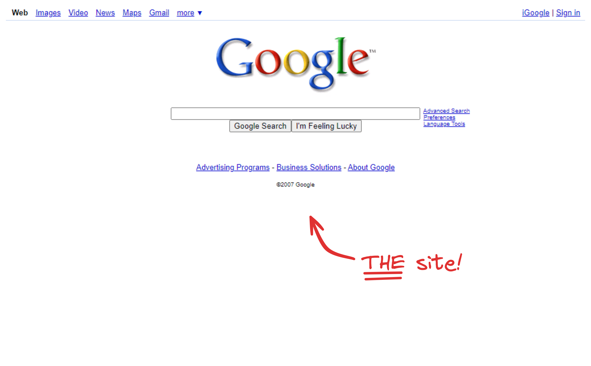
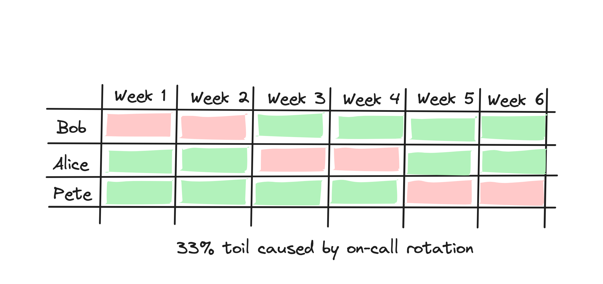

---
transition: fade-out
layout: image-right
image: /dbodky.jpeg
---

# About me

 

 

* Consultant at NETWAYS since 2021

* Working with technologies like

  * Kubernetes
  * Ansible
  * Prometheus
  * Grafana

* Interested in DevOps and SRE practices

---
transition: fade-out
layout: two-cols
---

# Site

 

 

* In the beginnings, **the** site - [google.com](https://google.com)
* nowadays, an arbitrary service

  * Maps
  * Mail
  * Adds

* provided by an SRE team
* consumed by users

::right::

 

 

 

 

---
transition: fade-out
layout: default
---

# Reliability

 

 

* The ability of a service to perform as expected upon request

* This is **not** the same as **availability**

* A service can be **available** but not **reliable**

  * high latency

  * high error rates

---
transition: fade-out
layout: default
---

# Engineering

 
 

### Members of SRE teams are...

 

⛔ classical system administrators
 
⛔ mainly systems engineers
 
✅ software engineers, first and foremost

---
transition: fade-out
layout: quote
---

# “[At Google, ] Common to all SREs is the belief in and aptitude for developing software systems to solve complex problems”

Benjamin Treynor Sloss, Vice President, Google Engineering, founder of Google SRE

---
transition: fade-out
layout: default
---

# Responsibilities

 

 

 

 

  

    <ul>
      <li><b>Availability</b></li>
      <li><b>Latency</b></li>
      <li><b>Performance</b></li>
      <li><b>Efficiency</b></li>
    </ul>
  

  

    <ul>
      <li>Change Management</li>
      <li><b>Monitoring</b></li>
      <li><b>Emergency Response</b></li>
      <li>Capacity Planning</li>
    </ul>
  

---
transition: fade-out
layout: section
---

# SLIs, SLOs, and Error Budgets

---
transition: fade-out
layout: image-right
image: ./wallet.jpg
---

# SLIs, SLOs, and Error Budgets

 

 

* SLIs (**Service Level Indicators**) are key metrics for your service(s)

* SLOs (**Service Level Objectives**) are targets for your SLIs

* Error Budgets are the difference between your SLOs and your actual SLIs

  Photo by <a href="https://unsplash.com/@emkal?utm_content=creditCopyText&utm_medium=referral&utm_source=unsplash">Emil Kalibradov</a> on <a href="https://unsplash.com/photos/person-holding-black-and-orange-box-swIN9v5uS5Y?utm_content=creditCopyText&utm_medium=referral&utm_source=unsplash">Unsplash</a>

---
transition: fade-out
layout: image-right
image: ./kiss.jpg
---

# Metrics Collection

 

 

* Looking at *all* metrics *all the time* is **not** feasible

* Focus on metrics that 

  * matter for your **end users**

  * can be used to forge **meaningful** SLIs

 

 

### **KISS** - **K**eep **I**t **S**hort and **S**imple!

Photo by <a href="https://unsplash.com/@timmossholder?utm_content=creditCopyText&utm_medium=referral&utm_source=unsplash">Tim Mossholder</a> on <a href="https://unsplash.com/photos/red-kiss-neon-signage-7aBrZmwEQtg?utm_content=creditCopyText&utm_medium=referral&utm_source=unsplash">Unsplash</a>

---
transition: fade-out
layout: image-right
image: ./dashboard.jpg
---

# SLI Generalization

 

 

**Generalize** SLIs:

Choose **sane defaults** for aggregation:

* **intervals** (e.g. 5 minutes)
* **methods** (e.g. average)
* **regions** (e.g. cluster-wide)
* **resolutions** (e.g. 10 second)

 

 

### **DRY** - **D**on't **R**epeat **Y**ourself!

Photo by <a href="https://unsplash.com/@hostreviews?utm_content=creditCopyText&utm_medium=referral&utm_source=unsplash">Stephen Phillips</a> on <a href="https://unsplash.com/photos/monitor-screengrab-shr_Xn8S8QU?utm_content=creditCopyText&utm_medium=referral&utm_source=unsplash">Unsplash</a>

---
transition: fade-out
layout: section
---

# Dealing with Toil

---
transition: fade-out
layout: image-right
image: ./todos.jpg
---

# Identifying Toil

 

 

**Recurring, boring** tasks that **don't** lead to **long-term** benefits:

 

🗑️ Manually restarting services
 
🗑️ Manually executing scripts
 
♻️ Handling pager alerts (for the first time)
 
♻️ Refactoring code to reduce technical debt

Photo by <a href="https://unsplash.com/@theblowup?utm_content=creditCopyText&utm_medium=referral&utm_source=unsplash">the blowup</a> on <a href="https://unsplash.com/photos/black-trash-bin-with-green-leaves-t06aN6vewaQ?utm_content=creditCopyText&utm_medium=referral&utm_source=unsplash">Unsplash</a>

---
transition: fade-out
layout: image-right
image: ./toil.jpg
---

# Managing Toil

 

 

* Distribute it evenly across the team

* Do it immediately

* Chip away at it, week by week

Photo by <a href="https://unsplash.com/@villxsmil?utm_content=creditCopyText&utm_medium=referral&utm_source=unsplash">Luis Villasmil</a> on <a href="https://unsplash.com/photos/people-sitting-on-chair-with-brown-wooden-table-mlVbMbxfWI4?utm_content=creditCopyText&utm_medium=referral&utm_source=unsplash">Unsplash</a>

---
transition: fade-out
layout: image-right
image: ./recycle.jpg
---

# Minimizing Toil

 

 

Aim for

* *automatic*, not *automated* systems and solutions
* needed maintenance scaling **< O(n)**
* a shared mindset that *some* toil is **inevitable**, but *too much* is **unacceptable**

Photo by <a href="https://unsplash.com/@gary_at_unsplash?utm_content=creditCopyText&utm_medium=referral&utm_source=unsplash">Gary Chan</a> on <a href="https://unsplash.com/photos/litter-signage-YzSZN3qvHeo?utm_content=creditCopyText&utm_medium=referral&utm_source=unsplash">Unsplash</a>

---
transition: fade-out
layout: section
---

# Being On-Call

---

# On-Call *is* Toil

 

On-Call time is a natural  **lower bound** to the amount of toil that can't be reduced.

**Be careful with introducing/allowing additional toil**.

---
transition: fade-out
layout: image-right
image: ./pager.jpg
---

# Balance is Key

 

 

**At Google**, two incidents per shift are seen as a good balance, leaving enough time for **proper handling** and **postmortems**.

 

* **More** incidents, and handling becomes hasty

* **Less** incidents, and the on-call engineer's time gets wasted

Photo by <a href="https://unsplash.com/@alex_andrews?utm_content=creditCopyText&utm_medium=referral&utm_source=unsplash">Alexander Andrews</a> on <a href="https://unsplash.com/photos/black-corded-telephone-JYGnB9gTCls?utm_content=creditCopyText&utm_medium=referral&utm_source=unsplash">Unsplash</a>

---
transition: fade-out
layout: image-right
image: ./idea.jpg
---

# Keep in mind

 

 

* Let your SREs **engineer**, not just **operate**

* Stay on top of our **SLIs**, **SLOs**, **Error Budgets**, and **Toil**

* **Act accordingly**

* Staff your SRE team(s) **appropriately**

Photo by <a href="https://unsplash.com/@jdiegoph?utm_content=creditCopyText&utm_medium=referral&utm_source=unsplash">Diego PH</a> on <a href="https://unsplash.com/photos/person-holding-light-bulb-fIq0tET6llw?utm_content=creditCopyText&utm_medium=referral&utm_source=unsplash">Unsplash</a>

---
transition: fade-out
layout: image-right
image: ./answers.jpg
---

# There's so much more

 

 

* Release Engineering

* Engineering for Automation

* Incident Management

... and much more. Maybe another time!

Photo by <a href="https://unsplash.com/@hadijasaidi?utm_content=creditCopyText&utm_medium=referral&utm_source=unsplash">Hadija</a> on <a href="https://unsplash.com/photos/a-sign-that-is-on-the-side-of-a-hill-jCfDzOQ2-C8?utm_content=creditCopyText&utm_medium=referral&utm_source=unsplash">Unsplash</a>

