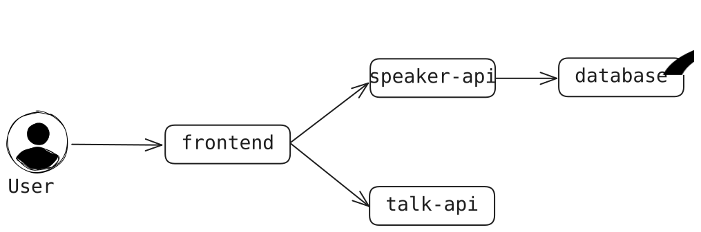
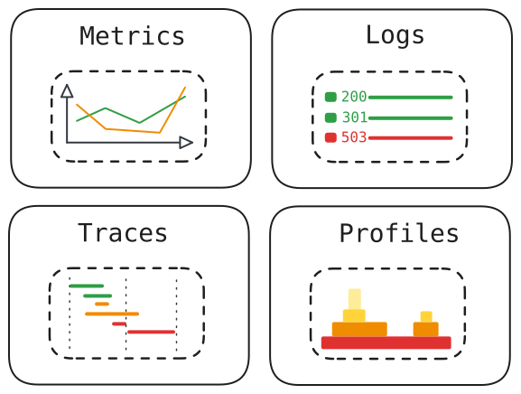
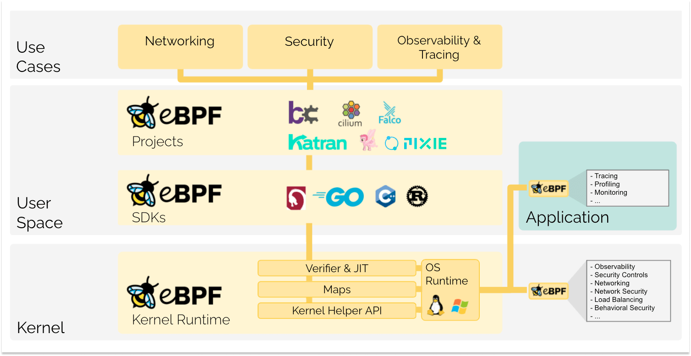
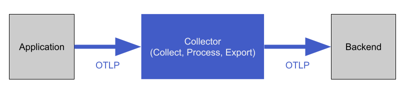
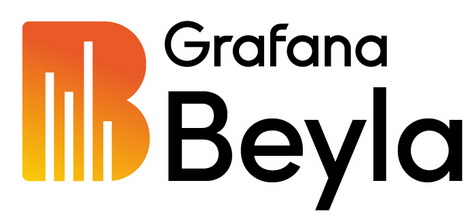
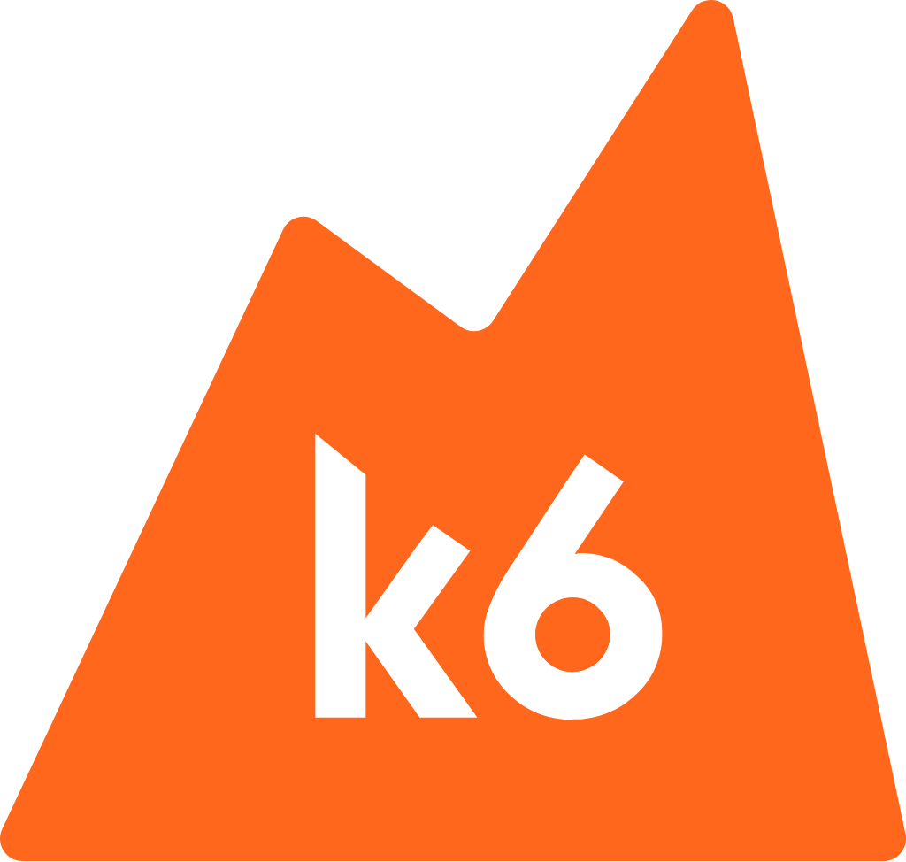

---
class: text-lg
---

# Housekeeping

What are we going to do?

- 📚 Housekeeping, first steps, introduction to OpenTelemetry
- 🔧 Zero-code instrumentation with OTel auto-instrumentation SDKs
- **11:30-11:45**: ☕ Coffee break
- ♻️ Collecting and processing OTel signals
- 🪄 Zero-touch instrumentation with Grafana Beyla
- 🤖 Synthetic generation of OTel signals
- **13:00-14:00**: 🍱 Lunch break
- 🔁 Comparison: SDK vs. Beyla instrumentation
- 🔋 All-in-one OTel setups with Grafana Alloy
- 🎬 Recap and questions
- **15:30**: ☕ Open-end coffee break, more questions, experimentation

---
layout: two-cols
class: text-xl
---

# About Me

- Senior Platform Advocate from Germany at **NETWAYS Web Services**
- Grafana Champion
- Especially interested in GitOps, Observability, IaC
- In my free time, I...
  - ...build small web apps
  - ...tinker with my homelab
  - ...learn about OpenTelemetry

::right::

<div class="h-full flex flex-col justify-center">
  
</div>

---
class: text-2xl
---

# About this Workshop

How to get started

<br />

Three simple steps:

1. Go to [osmc.nws.netways.de](https://osmc.nws.netways.de)
2. Enter the password: `osmc-otel-2025`
3. Click on **Start workshop**

---
class: text-2xl
---

# About Your Workshop Environments

What you find in there

<br />

- extensive dev tooling (`docker`, `git`, `npm`, etc.)
- tabs to view the applications you will be using (VS Code, Grafana, demo apps)
- these slides to follow along
- additional, interactive instructions for the hands-on parts

---
class: text-2xl
---

# Final preparations

Before we get started...

```sh
cd osmc-workshop
docker compose build
```

<style>
  code {
    @apply text-2xl;
  }

  .slidev-code {
    background-color: rgb(27, 27, 27);
    @apply mt-24;
  }
</style>

---
layout: section
---

# The Scenario

---

# The OSMC Explorer App

What we are dealing with

In order to instrument applications, we _need_ applications. Your environment contains a web application called **OSMC Explorer**.

It lets you:

- Browse talks chronologically
- View speaker bios
- Bookmark your favorite talks

You just built the microservices that make up the demo, written in various languages:

- `frontend` (NextJS/Typescript/NodeJS)
- `speaker-api` (Flask/Python)
- `talk-api` (Golang)

---

# Architecture Overview

How everything is connected



---

# Initial Observability State

What can we see out of the box?

Initially, all microservices are **not instrumented** at all.

- No OTel SDKs
- No builtin `/metrics` endpoints
- Basic logging to see _something_ when interacting with the services

<br />

<br />

We are going to change that over the course of this workshop while exploring different ways of OpenTelemetry auto-instrumentation available.

---
layout: section
---

# Lab 1: Explore the Demo App

---
layout: section
---

# What is OpenTelemetry?

---
layout: two-cols
---

# OpenTelemetry (OTel)

An open observability standard

<br />
<br />

- Open-Source **observability framework**
- Provides **tools, APIs**, and **SDKs** to **collect, process**,
  and **export** telemetry data
- **Vendor-neutral** and **standardized**
- **Tracks** and **communicates** progress of the project's components on the [OpenTelemetry website](https://opentelemetry.io)

::right::

<div class="h-full flex flex-col justify-center">
  
</div>

---
layout: two-cols
---

# OTel Signals

<br />

<br />

- **Metrics** for capturing metrics at runtime
- **Logs** for capturing timestamped text records
- **Traces** for capturing user interactions and events across service components
- **Profiles** for capturing code-level application performance and behavior at run-time (_still under development_)

::right::

<div class="m-l-4 h-full flex flex-col justify-center">



</div>

---

# Stability Overview Per Signal

How production-ready are the OTel SDKs?

| Signal | Stable | Beta | Development |
|----------|--------|-------|---|
| **Metrics** | <vscode-icons-file-type-go/> <vscode-icons-file-type-js-official/> <vscode-icons-file-type-python/>|||
| **Logs** | | <vscode-icons-file-type-go/> | <vscode-icons-file-type-js-official/> <vscode-icons-file-type-python/> |
| **Traces** | <vscode-icons-file-type-go/> <vscode-icons-file-type-js-official/> <vscode-icons-file-type-python/> | | |


<style>
  .slidev-icon {
    @apply w-10 h-10;
  }

  table {
    @apply w-full;
  }
</style>

---
class: text-xl
---

# OTel Instrumentation

SDKs and APIs

_For a system to be observable, it must be **instrumented**: that is, code from the system's components must emit signals, such as traces, metrics, and logs._ - [OTel Docs](https://opentelemetry.io/docs/concepts/instrumentation/)

- Two complementary strategies of instrumentation exist:
  - **Code-based**: deeper insights, rich telemetry from within the application itself
  - **Zero-code**: great for when you're just getting started or if you can't modify the application itself
- SDKs and APIs exist for various languages, in varying degrees of stability

<br />

➡️ **Today**, we are going to look at the **zero-code approach**

---
layout: section
---

# Lab 2: Instrumenting the speaker-api Service

---
layout: section
---

# Lab 3: Instrumenting the frontend Service

---
layout: section
---

# Intermezzo: What is eBPF?


---
class: text-2xl
---

# eBPF

Secure, privileged programs in the OS kernel

- Evolution of BPF (_Berkeley Packet Filter_)
- Allow you to **extend** functionalities of the OS kernel **at runtime** 
- **Sandboxing** and **JIT compilation** for high performance and security
- **event-based** and bound to _hooks_ (syscalls, tracepoints, etc.)
- more and more influence and traction in **networking, security** and **observability**

---

# Overview of eBPF



<div class="text-gray p-l-20">

Figure taken from [ebpf.io](https://ebpf.io/what-is-ebpf/#what-is-ebpf).

</div>

---
class: text-xl
---

# The eBPF Lifecycle

Heavily simplified

1. Identification of desired hooks (e.g. `execve` syscall)
2. Loading of the eBPF probe for the identified hook
3. Verification of correctness and security of the eBPF probe:
    - _Is the executing process adequatly privileged?_
    - _Is the eBPF probe's size within the configured range?_
    - _Is the eBPF probe's complexity low enough?_
    - _Can memory safety of the eBPF probe be guaranteed?_
    - _Is the eBPF probe proven to terminate?_
4. Compilation of the eBPF probe to bytecode
5. Execution of the eBPF probe for the desired events (_Hook Point_, _kprobe_ oder _uprobe_)

---
layout: section
---

# Lab 4: Instrumenting the talk-api Service

---
layout: section
---

# Collecting, Processing, and Storing OTel Signals

---
layout: two-cols
---

# OTel Collector

Where all signals comes together

<br />

- **Receives, processes**, and **exports** telemetry data
- Vendor-agnostic
- Reduces overhead of operating multiple, signal-specific agents/collectors
- Takes care of additional tasks like...
  - ...**batching** of telemetry data
  - ...**retrying** failed forwarding to backends
  - ...**encrypting** telemetry data

::right::

<div class="h-full flex flex-col justify-center">
  
</div>

---

# OTel Collector


---
layout: section
---

# Lab 5: Collecting and Storing Telemetry Data

---
layout: section
---

# eBPF Application Instrumentation With Grafana Beyla

---
layout: two-cols
---

# Why Beyla?

- Sometimes, auto-instrumentation isn't the most feasible way, due to:
  - many ephemeral workloads
  - too many different languages and SDKs
  - tweaks needed for compiled languages (e.g. Rust or Go)
- Beyla offers **eBPF-based** auto-instrumentation for:
  - applications in many languages
  - the OS networking stack
  - container and Kubernetes environments

::right::



---
layout: two-cols
---

# How Does Beyla Work?

Baseline instrumentation for applications

- Beyla instruments applications using eBPF:
  - inspects the OS TCP/IP stack
  - identifies requests from/to applications
  - generates traces/metrics following OTel semantic conventions
- Beyla can auto-detect applications by invoked binary or port usage
- Beyla can enrich OTel signals with container/Kubernetes information
- Beyla can be configured using environment variables or a dedicated config with service discovery

::right::


---
layout: section
---

# Lab 6: Application Auto-Instrumentation with Grafana Beyla

---
layout: section
---

# Synthetic Traffic and Signals with k6



---
layout: two-cols
---

# Grafana k6

Synthetic testing with Javascript

- [k6](https://k6.io) is an extensible load testing tool by Grafana
- it can run...
  - load/performance tests
  - browser tests
  - synthetic monitoring
  - infrastructure tests

➡️ This means we can use k6 to generate more requests and thus more telemetry signals for our demo application

::right::

<div class="h-full flex-col justify-center">

```js
import http from 'k6/http'
import { sleep } from 'k6'

export let options = {
  thresholds: {
    http_req_duration: ['p(95)<500', 'p(99)<1500'],
  },
}

export default function () {
  const BASE_URL = 'https://test-api.k6.io'

  http.get(`${BASE_URL}/public/crocodiles`)
  http.get(`${BASE_URL}/public/crocodiles/1`)
  http.get(`${BASE_URL}/public/crocodiles/2`)
  sleep(0.3)
}
```

</div>

<style>
  .slidev-code {
    background-color: rgb(27, 27, 27);
    @apply mt-24;
  }
</style>

---
layout: section
---

# Lab 7: Generating Synthetic OTel Signals

---
layout: two-cols
---

# Thank you

for participating in this workshop

<br />
<br />

📊 **Slides**: [slides.dbodky.me/osmc-nuremberg-2025](https://slides.dbodky.me/osmc-nuremberg-2025)

<fa6-brands-github /> **Workshop**: [mocdaniel/osmc-workshop](https://github.com/osmc-workshop)

👍 **Feedback**: [feedback.dbodky.me](https://feedback.dbodky.me) 

<div class="m-l-6 m-t--2" >

  Code: `OSMC-OTEL`

</div>

::right::

<div class="h-full flex flex-col items-center m-x-auto">

## Slides


## Feedback


</div>