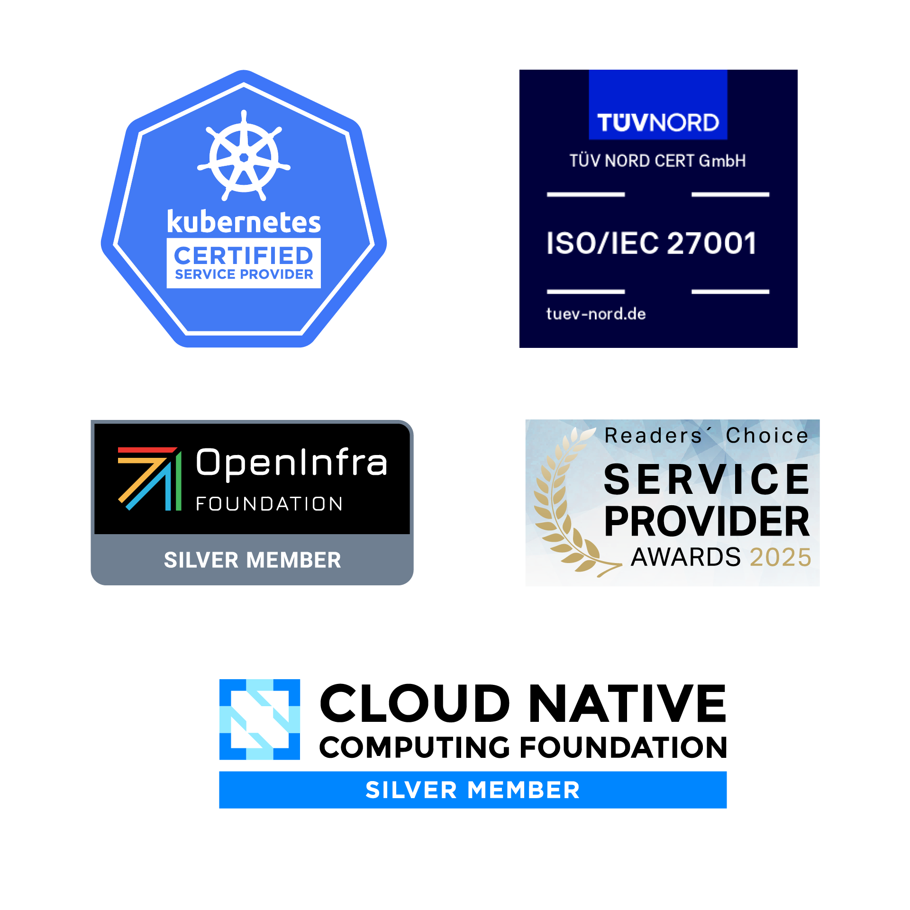
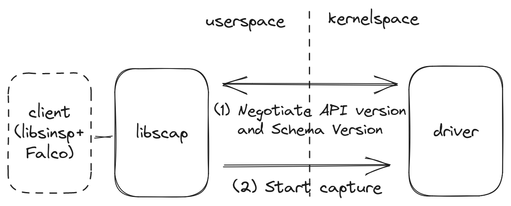
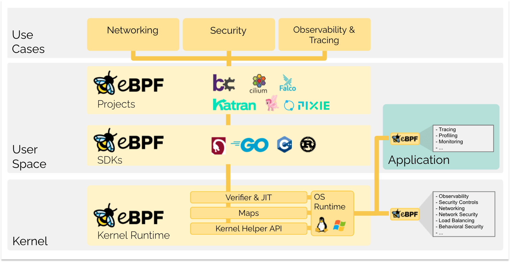
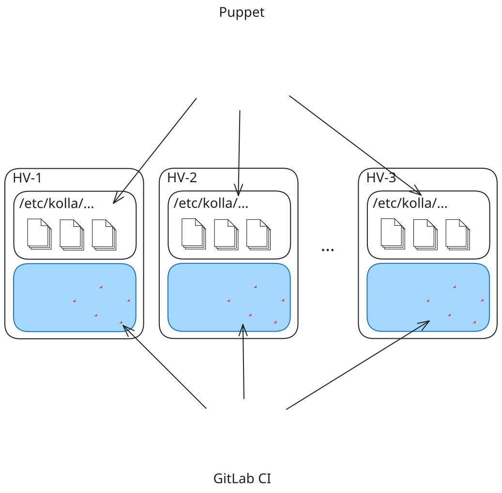
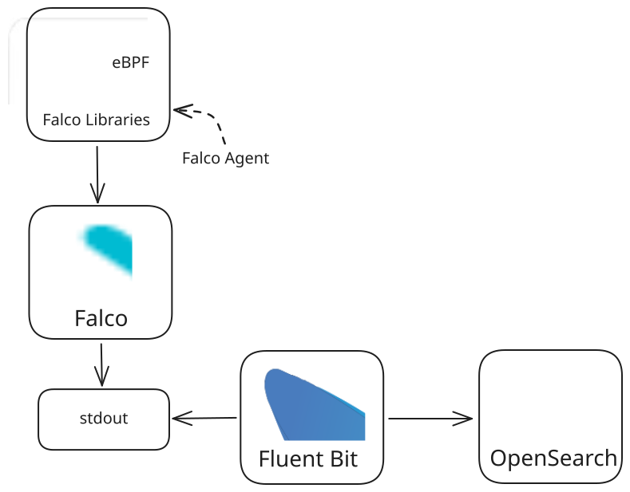
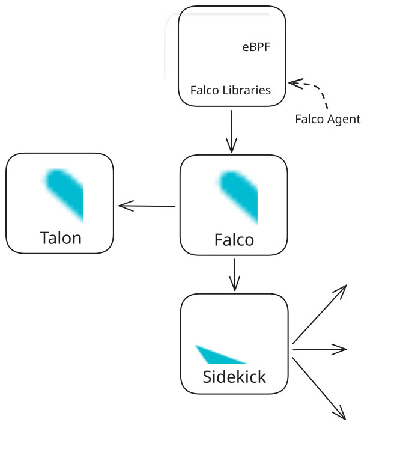

# Who Watches the Watchmen?

Echtzeit-Threat-Detection auf Hypervisoren mit Falco

<div class="mt-12 py-1">
  S2N Regensburg 2025 <br/>
  22. Oktober 2025
</div>


---
layout: two-cols
---

# Wer bin ich?

<br />

- Senior Platform Advocate bei
  **NETWAYS Web Services** in Nürnberg
- Interessensgebiete:
  - Kubernetes
  - Observability
  - GitOps und IaC
- Außerdem interessieren mich..
  - ...Webentwicklung
  - ...Homelabbing
  - ...OpenTelemetry

::right::

<div class="h-full flex flex-col justify-center">
  
</div>

---
layout: two-cols
---

# Wer sind wir?

NETWAYS Web Services bietet

- Public Cloud basierend auf OpenStack
  - Compute
  - Netzwerk
  - Block/Object Storage
  - Dedizierte CPUs/GPUs
- Managed Kubernetes®
- Managed AI Models
- Fertige Managed Plattformen (GitLab, Nextcloud, Observability Stacks) und Individuallösungen durch unsere MyEngineers®

::right::

<div class="h-full flex flex-col justify-center">
  
</div>

---

# Die NETWAYS Cloud in Zahlen

Womit arbeiten wir?

- **2 Rechenzentren** (colocated), verbunden durch redundante, dedizierte Leitung
- **~1300 CPU Cores**
- **~1.4PB Ceph-Cluster** mit ~340 OSDs
- **GPUs** (A10, A40, RTX 6000 Blackwell)
- **~2000 VMs** von Kunden
- **~60 Kubernetes Cluster** von Kunden

---
layout: quote
---

# _Networks, systems and applications shall be monitored for anomalous behaviour and appropriate actions taken to evaluate potential information security incidents._

\- ISO/IEC 27001:2022, Annex A, 8.16 Monitoring Activities

---
layout: section
---

# Falco im Überblick

Runtime Security für Hosts, Container, Kubernetes und Cloudumgebungen

---
layout: two-cols
---

# Was ist Falco?

- Software zur **Echtzeit-Erkennung von Events**
- Baseline an Regeln inklusive
- Einsetzbar auf verschiedenen Ebenen:
  - Host (Bare Metal oder VM)
  - Container (Docker, Kubernetes, Nomad)
- Integrationen für externe Systeme, z.B.
  - Hyperscaler (AWS, GCP, Azure, RedHat)
  - Observability-Lösungen (Grafana, Datadog)
  - IAM (z.B. Okta)
- Verschiedene Architekturen ermöglichen den Einsatz auch in Legacy-Umgebungen

::right::

<div class="h-full flex flex-col justify-center">
  
</div>

---

# Architektur von Falco


---
layout: two-cols
---

# Falco Rules

```yaml
- rule: shell_in_container
  desc: notice shell activity within a container
  condition: >
    evt.type = execve and 
    evt.dir = < and 
    container.id != host and 
    (proc.name = bash or
     proc.name = ksh)    
  output: >
    shell in a container |
    user=%user.name
    container_id=%container.id
    container_name=%container.name 
    shell=%proc.name parent=%proc.pname
    cmdline=%proc.cmdline    
  priority: WARNING
```

::right::

<div class="flex justify-center items-center h-full m-l-8">

- YAML-Objekte mit benötigten + optionalen Keys
- `condition` kann aus Macros und Lists zusammengebaut werden
- `output` kann auf Metadaten des beobachteten Events zurückgreifen

</div>

<style>
  .slidev-code {
    background-color: rgb(27, 27, 27);
  }
</style>
---

# Falco im Kernel

Für die Verarbeitung von Events auf überwachten Endpoints beobachtet Falco **syscalls** und **Kernel Functions**. Hierfür wird einer von drei *Drivern* installiert:

<br/>

<div class="grid grid-cols-3">
<div class="border-r-1 p-x-2">

### 🥉 Kernel Module

- ab Kernel-Version:
  - **x86-Systeme**: >= 2.6
  - **aarch64-Systeme**: >= 3.4
- muss bei Installation von Falco auf dem Host dauerhaft installiert werden und wird von Falco geladen.

</div>

<div class="p-x-2">

### 🥇 Modern eBPF Probe

- ab Kernel-Version: >= 5.8
- Weniger Overhead als das Kernelmodul, integriert in Falco
- Falco lädt das eBPF-Programm bei Bedarf
- [*Least Privileged Mode*](https://falco.org/docs/concepts/event-sources/kernel/#least-privileged-mode-1) konfigurierbar

</div>

<div class="border-l-1 p-x-2">

### 🥈 Legacy eBPF Probe

- ab Kernel-Version:
  - **x86-Systeme**: >= 4.14
  - **aarch64-Systeme**: >= 4.17
- verhält sich analog zur *Modern eBPF Probe*

</div>

</div>

<style>
  .slidev-layout h1 + p {
    opacity: 1.0;
  }

  .slidev-layout li {
    line-height: 1.4em;
  }
</style>

---

# Userspace vs. Kernelspace



<div class="text-gray">

Grafik aus der [Dokumentation von Falco](https://falco.org/docs/concepts/event-sources/kernel/architecture/#how-falco-interacts-with-kernel-components) entnommen.

</div>

---
layout: section
---

# Exkurs: Was ist eBPF?


---

# eBPF

Sichere, privilegierte Programme im OS-Kernel

- Weiterentwicklung von BPF (_Berkeley Packet Filter_)
- Ermöglichen **Erweiterung** der Funktionen des OS-Kernels **zur Laufzeit**
- **Sandboxing** und **JIT-Kompilierung** für hohe Performance und Sicherheit
- **Event-basiert** und an _Hooks_ gebunden (syscalls, Tracepoints, usw.)
- mehr und mehr Einfluss in den Bereichen **Networking, Security** und **Observability**

---

# eBPF im Überblick



<div class="text-gray p-l-20">

Grafik von [ebpf.io](https://ebpf.io/what-is-ebpf/#what-is-ebpf) entnommen.

</div>

---

# Der eBPF Lifecycle

Stark vereinfacht

1. Identifizierung des gewünschten Hooks (z.B. `execve` syscall)
2. Laden des eBPF Programms an der identifizierten Stelle
3. Verifizierung der Korrektheit und Sicherheit des eBPF Programms:
    - _Ist der ausführende Prozess ausreichend privilegiert?_
    - _Ist die Größe des eBPF Programms im konfigurierten Rahmen?_
    - _Ist die Komplexität des eBPF Programms niedrig genug?_
    - _Kann die Speichersicherheit des eBPF Programms garantiert werden?_
    - _Terminiert das eBPF Programm nachweislich?_
4. Kompilierung des eBPF Programms in Bytecode
5. Ausführung des eBPF Programms an der gewünschten Stelle (_Hook Point_, _kprobe_ oder _uprobe_)

---
layout: section
---

# Falco@NETWAYS

---
layout: two-cols
---

# Falco@NETWAYS

Unsere Ausgangslage


- OpenStack-Komponenten als Container aus dem [OpenStack Kolla Projekt](https://github.com/openstack/kolla)
- Patches etc. via GitLab CI
- Konfiguration via Puppet
- Deployment auf den Hypervisoren (Baremetal) via GitLab CI
- Kein Managementlayer unter OpenStack (Kubernetes, Yaook, etc.)

::right::

<div class="m-l-4 h-full flex justify-center items-center">
  
</div>

---
layout: two-cols
---

# Falco@NETWAYS

Unser Falco-Setup

- Deployment mit Docker
- Baseline Ruleset mit wenigen Ergänzungen
- kein Falco Sidekick oder Talon im Einsatz
- Events werden v.a. für Audits benötigt:
  - Scraping via FluentBit
  - OpenSearch als Langzeitspeicher
  - keine Alarmierung oder (automatische) Reaktionen 

::right::

<div class="m-l-4 h-full flex justify-center items-center">
  
</div>

---
layout: two-cols
---

# Falco@NETWAYS

Nächste Schritte

- Verarbeitung von Events durch Falco Sidekick
  - Grafana IRM
  - On-Call Pager
  - OpenSearch
- Evaluierung von Falco Talons Entwicklung
  - Unterbindung von einzelnen auffälligen Prozessen (wie Tetragon)
  - _Quarantäne-Modus_
  - Mitschneiden von Shell-/Containersessions

::right::

<div class="m-l-4 h-full flex justify-center items-center">
  
</div>

---

# Falco@NETWAYS

Unsere Evaluierung Falco vs Tetragon

| | **Falco** | **Tetragon** |
|:--- |----|----|
|Technologie | Kernel Modul/eBPF | eBPF |
| Management in Kubernetes | Daemonset + Sidecar | Daemonset + Operator |
| Konfiguration | Rulefiles + Baseline-Regelset | CRDs + Sammlung an Beispielen |
| Lernkurve | **Flach** | **Steil** |
| Features | **Ausreichend** (Eventsourcing, einfache Reaktionen) | **Umfangreich** (Eventsourcing mit Custom Hooks, Reaktionen auf Processlevel) |

---
layout: section
---

# 💻 Demo

---

# Fazit und Takeaways

<ul>
 <li v-click>
 
 Falco bietet einen exzellenten Einstieg für neue Nutzer:
  - Baseline an verfügbaren Regeln
  - abstrahierte Konzepte aus dem Kernel, menschenlesbar
  - Integrationen für verschiedene Eventquellen und -Destinationen

  </li>
  <li v-click>
  
  Falco ist ein stiller Beobachter:
  - Events werden nur protokolliert und weitergeleitet
  - Falco Talon ist noch nicht vollends ausgereift

  </li>
  <li v-click>
  
  Je nach Gesichtspunkt gibt es durchaus Tradeoffs:
  - Regelabstraktionen vs vollständige Kontrolle im Kernel
  - schlankes Deployment-Modell vs. umfangreicheres Managementlayer
  - All-in-One vs. Plugin/Spezialisierungen

  </li>
</ul>

---
layout: two-cols
---

# Vielen Dank

für eure Aufmerksamkeit

<br />
<br />

📊 **Slides**: [slides.dbodky.me/s2n-regensburg-2025](https://slides.dbodky.me/s2n-regensburg-2025)

<fa6-brands-github /> **Demos**: [netways-web-services/falco-k8s-demo](https://github.com/netways-web-services/falco-k8s-demo)

📚 **Falco Website**: [falco.org](https://falco.org)

👍 **Feedback**: [feedback.dbodky.me](https://feedback.dbodky.me) 

<div class="m-l-6 m-t--2" >

  Code: `S2NF-ALCO`

</div>

::right::

<div class="h-full flex flex-col items-center m-x-auto">

## Slides


## Feedback


</div>
