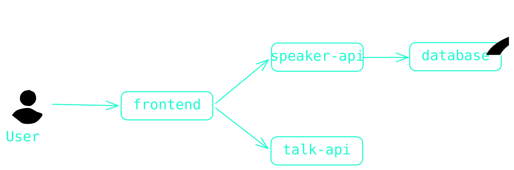
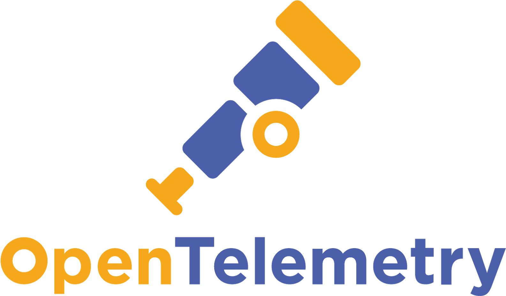
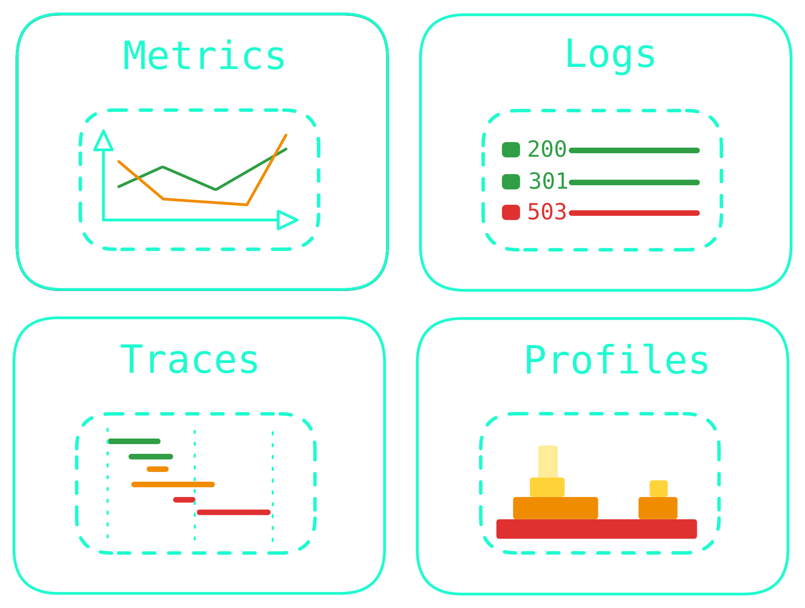
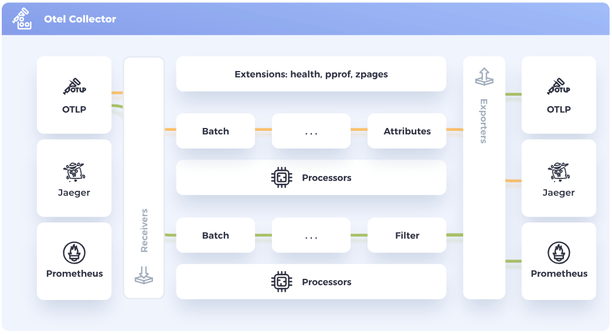
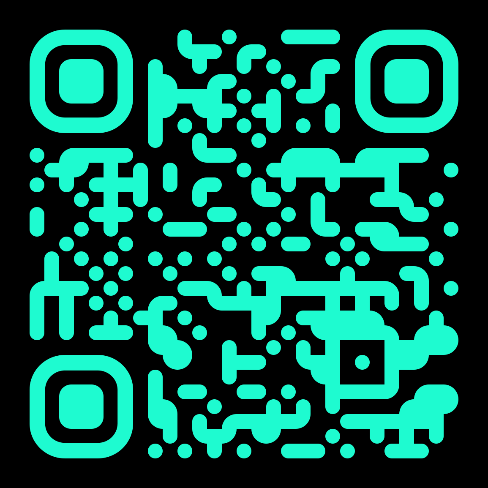
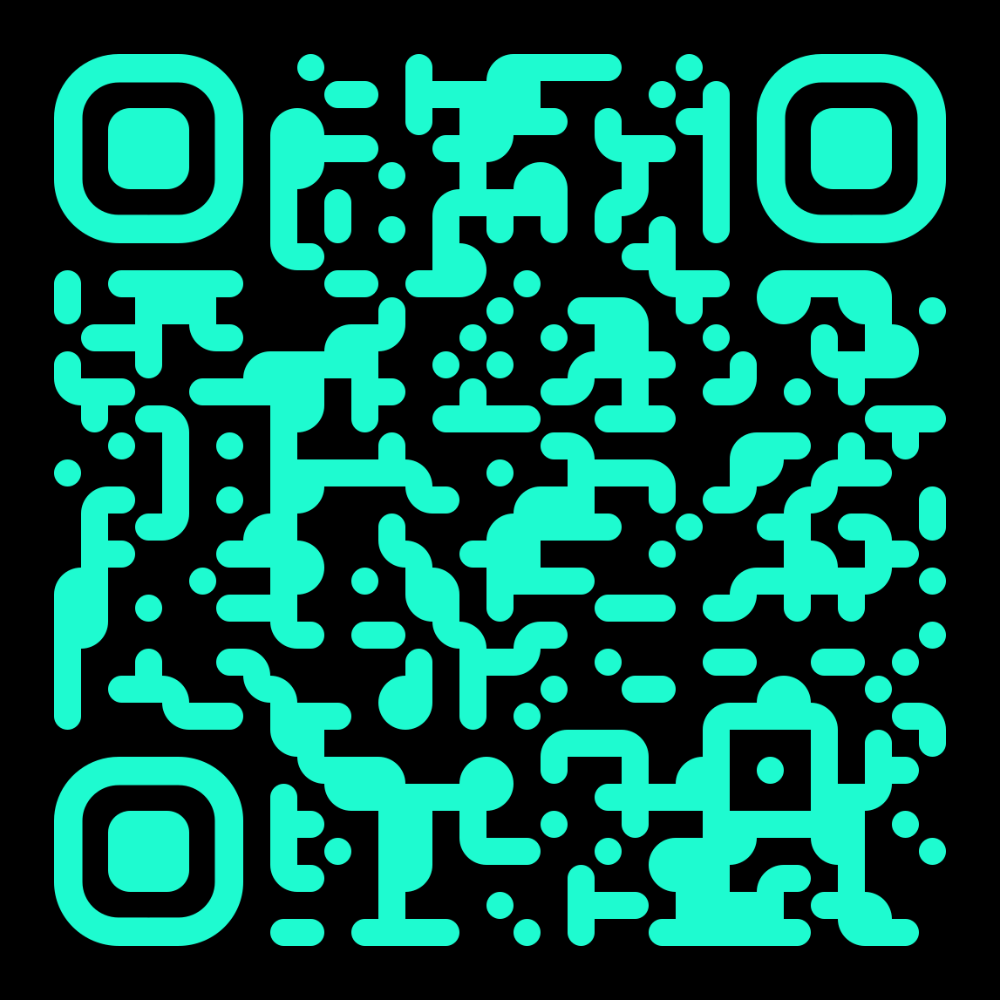

# Von Zero Observability zu Zero-Code Observability

## SLAC 2026 - 13. Mai 2026

---

# Organisatorisches

## Wie sieht der Workshop aus?

- 📚 Organisatorisches, erste Schritte, Einführung in OpenTelemetry
- 🔧 Zero-Code-Instrumentierung mit OTel Auto-Instrumentation SDKs
- ♻️ Sammeln und Verarbeiten von OTel-Signalen
- 🪄 Zero-Touch-Instrumentierung mit Grafana Beyla
- 🎬 Zusammenfassung, Fragen und optionale Themen

---
layout: two-cols
---

# Wer bin ich?

::left::

- Senior Platform Advocate aus Deutschland bei **NETWAYS Web Services**
- Grafana Champion
- Besonders interessiert an Kubernetes, Observability, IaC
- In meiner Freizeit...
  - ...baue ich kleine Web-Apps
  - ...bastle ich an meinem Homelab
  - ...lerne ich mehr über OpenTelemetry

::right::

<div class="h-full flex flex-col justify-center">
  
</div>

---

# Über diesen Workshop

## Starten der Workshop-Umgebung

<br />

Drei einfache Schritte:

1. Gehe auf [slac.nws.netways.de](https://slac.nws.netways.de)
2. Gib das Passwort ein: `slac-otel-2026`
3. Klicke auf **Start workshop**

---

# Über die Workshop-Umgebungen

## Was man darin findet

<br />

- umfangreiches Dev-Tooling (`docker`, `git`, `npm`, etc.)
- Tabs zur Anzeige der Anwendungen, die wir nutzen werden (VS Code, Grafana, Demo-Apps)
- diese Slides zum Mitlesen
- zusätzliche, interaktive Anleitungen für die interaktiven Abschnitte

---

# Letzte Vorbereitungen

Bevor wir loslegen...

```sh
docker compose build
```

<style>
  code {
    @apply text-2xl;
  }

  .slidev-code-wrapper {
    @apply max-w-full w-full;
    @apply mt-16!;

  }
</style>

---
layout: section
---

# Das Workshop-Szenario

---

# Die SLAC Explorer App

## Womit werden wir arbeiten?

Um Anwendungen zu instrumentieren, _brauchen_ wir Anwendungen. Eure Umgebung enthält eine Webanwendung namens **SLAC Explorer**.

Sie ermöglicht:

- Vorträge chronologisch durchzustöbern
- Speaker-Bios anzusehen
- Lieblingsvorträge mit Lesezeichen zu versehen

---

# Die SLAC Explorer App

## Womit werden wir arbeiten?

Gerade haben wir die Microservices gebaut, aus denen die Demo besteht, geschrieben in verschiedenen Sprachen:

- `frontend` (NextJS/Typescript/NodeJS)
- `speaker-api` (Flask/Python)
- `talk-api` (Golang)

---

# Architektur-Übersicht

## Wie alles miteinander verbunden ist



---

# Anfänglicher Observability-Stand

## Was sehen wir Stand Jetzt?

Anfangs sind die Microservices **nicht instrumentiert**.

- Keine OTel SDKs
- Keine eingebauten `/metrics`-Endpunkte
- Einfaches Logging, um nachvollziehen zu können, wenn man mit den Services interagiert

<br />

<br />

Im Laufe dieses Workshops werden wir das ändern und dabei verschiedene Möglichkeiten der OpenTelemetry-Auto-Instrumentierung erkunden.

---
layout: section
---

# Lab 1: Erkundung der Demo-App

---
layout: section
---

# Was ist OpenTelemetry?

---
layout: two-cols
---

# OpenTelemetry (OTel)

## Ein offener Observability-Standard

::left::

- Open-Source-**Observability-Framework**
- Bietet **Tools, APIs** und **SDKs** zum **Sammeln, Verarbeiten**
  und **Exportieren** von Telemetriedaten
- **Herstellerunabhängig** und **standardisiert**
- **Verfolgt** und **kommuniziert** den Fortschritt der Projektkomponenten auf der [OpenTelemetry-Website](https://opentelemetry.io)

::right::

<div class="h-full flex flex-col justify-center">
  
</div>

---
layout: two-cols
---

# OTel-Signale

::left::

- **Metrics** zum Erfassen von Metriken zur Laufzeit
- **Logs** zum Erfassen von zeitlich eingeordneten Events
- **Traces** zum Erfassen von Benutzerinteraktionen und Ereignissen über Servicekomponenten hinweg
- **Profiles** zum Erfassen von Anwendungsleistung und -verhalten auf Code-Ebene zur Laufzeit (_noch in Entwicklung_)

::right::

<div class="m-l-4 h-full flex flex-col justify-center">



</div>

---

# Stabilitätsübersicht je Signal

## Wie produktionsreif sind die OTel SDKs?

| Signal      | Stable                                                                                              | Beta                         | Development                                                            |
| ----------- | --------------------------------------------------------------------------------------------------- | ---------------------------- | ---------------------------------------------------------------------- |
| **Metrics** | <vscode-icons-file-type-go/> <vscode-icons-file-type-js-official/> <vscode-icons-file-type-python/> |                              |                                                                        |
| **Logs**    |                                                                                                     | <vscode-icons-file-type-go/> | <vscode-icons-file-type-js-official/> <vscode-icons-file-type-python/> |
| **Traces**  | <vscode-icons-file-type-go/> <vscode-icons-file-type-js-official/> <vscode-icons-file-type-python/> |                              |                                                                        |

<style>
  .slidev-icon {
    @apply w-10 h-10;
  }

  table {
    @apply w-full;
  }
</style>

---

# OTel-Instrumentierung

## SDKs und APIs

_Damit ein System beobachtbar ist, muss es **instrumentiert** werden: das heißt, der Code der Systemkomponenten muss Signale wie Traces, Metrics und Logs emittieren._ - [OTel Docs](https://opentelemetry.io/docs/concepts/instrumentation/)

- Es gibt zwei sich ergänzende Strategien zur Instrumentierung:
  - **Code-basiert**: tiefere Einblicke, individuelle Telemetrie aus der Anwendung selbst
  - **Zero-Code**: ideal für den Einstieg oder wenn man die Anwendung selbst nicht ändern kann
- SDKs und APIs gibt es für verschiedene Sprachen, in unterschiedlichen Stabilitätsstufen

<br />

➡️ **Heute** schauen wir uns den **Zero-Code-Ansatz** an

---
layout: section
---

# Lab 2: Instrumentierung des speaker-api Service

---
layout: section
---

# Lab 3: Instrumentierung des frontend Service

---
layout: section
---

# Intermezzo: Was ist eBPF?

---

# eBPF

## Sichere, privilegierte Programme im OS-Kernel

- Weiterentwicklung von BPF (_Berkeley Packet Filter_)
- Ermöglicht es, Funktionalitäten des OS-Kernels **zur Laufzeit zu erweitern**
- **Sandboxing** und **JIT-Kompilierung** für hohe Performance und Sicherheit
- **Event-basiert** und an _Hooks_ gebunden (Syscalls, Tracepoints, etc.)
- Immer mehr Einfluss und Verbreitung in **Networking, Security** und **Observability**

---

# Übersicht zu eBPF


<div class="text-gray p-l-20">

Abbildung übernommen von [ebpf.io](https://ebpf.io/what-is-ebpf/#what-is-ebpf).

</div>

---

# Der eBPF-Lebenszyklus

Stark vereinfacht

1. Identifikation der gewünschten Hooks (z.B. `execve`-Syscall)
2. Laden der eBPF-Probe für den identifizierten Hook
3. Verifikation der Korrektheit und Sicherheit der eBPF-Probe:
   - _Ist der ausführende Prozess ausreichend privilegiert?_
   - _Liegt die Größe der eBPF-Probe im konfigurierten Bereich?_
   - _Ist die Komplexität der eBPF-Probe gering genug?_
   - _Kann die Speichersicherheit der eBPF-Probe garantiert werden?_
   - _Ist nachgewiesen, dass die eBPF-Probe terminiert?_
4. Kompilierung der eBPF-Probe zu Bytecode
5. Ausführung der eBPF-Probe für die gewünschten Events (_Hook Point_, _kprobe_ oder _uprobe_)

---
layout: section
---

# Lab 4: Instrumentierung des talk-api Service

---
layout: section
---

# Sammeln, Verarbeiten und Speichern von OTel-Signalen

---

# OTel Collector

## Wo alle Signale zusammenlaufen

- **Empfängt, verarbeitet** und **exportiert** Telemetriedaten
- Herstellerunabhängig
- Reduziert den Overhead beim Betrieb mehrerer signal-spezifischer Agents/Collectors
- Übernimmt zusätzliche Aufgaben wie...
  - ...**Batching** von Telemetriedaten
  - ...**Wiederholungsversuche** bei fehlgeschlagener Weiterleitung an Backends
  - ...**Verschlüsselung** von Telemetriedaten

---

# OTel Collector



---
layout: section
---

# Lab 5: Sammeln und Speichern von Telemetriedaten

---
layout: section
---

# eBPF-Anwendungs-instrumentierung mit Grafana Beyla

---

# Warum Beyla?

## Auto-Instrumentierung unabhängig von Anwendungsumgebungen

- Manchmal ist Auto-Instrumentierung nicht der praktikabelste Weg, aufgrund von:
  - vielen kurzlebigen Workloads
  - zu vielen verschiedenen Sprachen und SDKs
  - notwendigen Anpassungen für kompilierte Sprachen (z.B. Rust oder Go)
- Beyla bietet **eBPF-basierte** Auto-Instrumentierung für:
  - Anwendungen in vielen Sprachen
  - den Netzwerk-Stack des Betriebssystems
  - Container- und Kubernetes-Umgebungen

---

# Wie funktioniert Beyla?

## Basis-Instrumentierung für Anwendungen

- Beyla instrumentiert Anwendungen mit eBPF:
  - inspiziert den TCP/IP-Stack des Betriebssystems
  - identifiziert Requests von/zu Anwendungen
  - generiert Traces/Metrics gemäß _OTel Semantic Conventions_
- Beyla kann Anwendungen automatisch anhand der aufgerufenen Binary oder der Port-Nutzung erkennen
- Beyla kann OTel-Signale mit Container-/Kubernetes-Informationen anreichern
- Beyla lässt sich über Umgebungsvariablen oder eine dedizierte Konfiguration mit Service Discovery konfigurieren

---
layout: section
---

# Lab 6: Anwendungs-Auto-Instrumentierung mit Grafana Beyla

---
layout: two-cols
---

# Vielen Dank

für eure Teilnahme an diesem Workshop

::left::

📊 **Slides**: [slides.dbodky.me/slac-berlin-2026](https://slides.dbodky.me/slac-berlin-2026)

💻 **Workshop**: [mocdaniel/slac-workshop](https://github.com/slac-workshop)

👍 **Feedback**: [feedback.dbodky.me](https://feedback.dbodky.me/feedback/SLACOTEL)

<div class="m-l-6 m-t--2" >

Code: `SLAC-OTEL`

</div>

::right::

<div class="h-full flex flex-col items-center m-x-auto -m-t-20">

## Slides



## Feedback



</div>
